# M88 Game stick patch

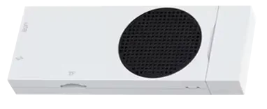

## Customization of [Helio P65](https://nanoreview.net/en/soc/mediatek-helio-p65) (MT6768) M88 Game Stick

## Table of Contents
1. [Introduction](#introduction)
   1. [The Problem](#the-problem)
   2. [Patch Overview](#patch-overview)
2. [Firmware Upgrade](#firmware-upgrade)
   1. [Enter BROM Mode](#enter-brom-mode)
   2. [Install Drivers & Flash Tool](#install-drivers--flash-tool)
   3. [Read From eMMC](#read-from-emmc)
   4. [Write To eMMC](#write-to-emmc)
3. [RetroArch Setup](#retroarch-setup)
   1. [Overriding Configs](#overriding-configs)
   2. [SD Card Path](#sd-card-path)
   3. [Hotkeys](#hotkeys)
   4. [Platform Controller](#platform-controller)
   5. [Shaders](#shaders)
   6. [Core Settings](#core-settings)
   7. [Core Mapping](#core-mapping)
   8. [Game Won't Start](#game-wont-start)
4. [Adding / Removing / Replacing Games](#adding--removing--replacing-games)
5. [Graphic Settings](#graphic-settings)
6. [Scripts](#scripts)


## Introduction

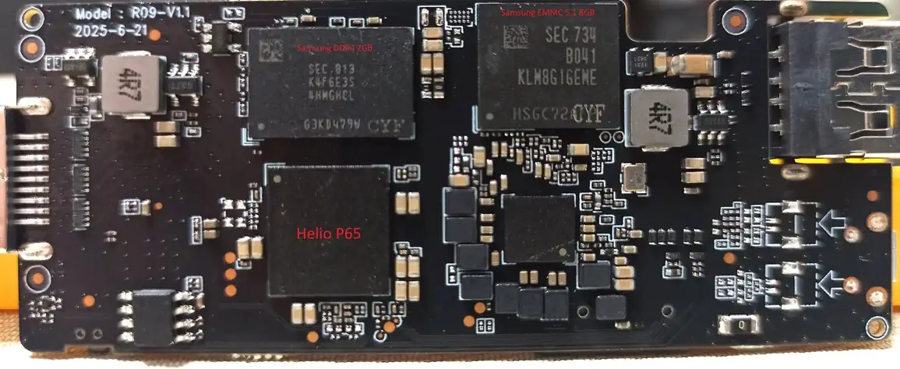

M88 is a Chinese game-stick which comes with a locked-down system, unfinished features and deceptive marketing. Without
passive culling it may overheat quickly in hard 3D.

Hardware:

1. [Helio P65](https://nanoreview.net/en/soc/mediatek-helio-p65) chipset.
2. [eMMC 5.1](https://semiconductor.samsung.com/estorage/emmc/emmc-5-1/klm8g1geme-b041/) or similar.
3. [DDR4 16Gb d / 2GB](https://semiconductor.samsung.com/dram/lpddr/lpddr4/k4f6e3s4hm-ghcl/) or similar.

The manufacturer claims PS2 emulation, but with P65 chipset + only 2GB memory chip on board it's basically unplayable. 
AetherSX2 / NetherSX2 officially recommend 4-8 GB, for that reason no PS2 patch / update is included.

This guide shows how to upgrade M88 firmware which allows:

1. Button mapping (RealPad->RetroPad).    
2. Setup hotkeys.
3. Change controller behaviour (RetroPad->PlatformPad).
4. Install latest cores.
5. Remap cores.
6. Change core settings.
7. Enable shaders.
8. Unlock multiple save / load slots.
9. Missed BIOSes fixed.
10. Standard RetroArch menu with settings.
11. Replace mupen64plusae to RetroArch (mupen64plus_next_gles3_libretro_android.so)

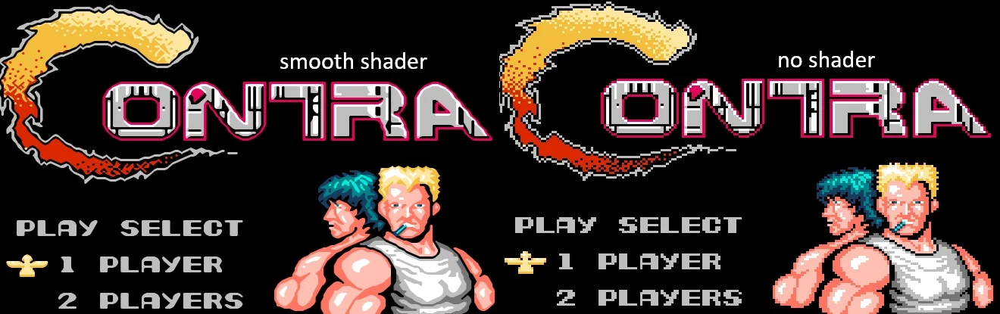


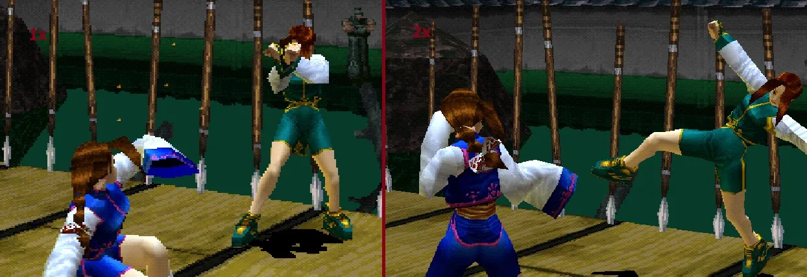

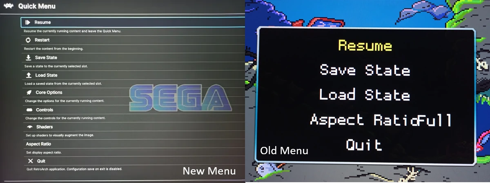

List of platforms:

```
                                                    [Quality]*
1.  PS2             - aethersx2 []                  [Awful]
2.  PSP             - ppsspp    []                  [Awesome]
3.  PSX             - RetroArch [swanstation]       [Meh]     [BIOS ok]
4.  Nintendo64      - mupen/RA  [parallel_n64]      [Awesome] [BIOS ok]
5.  Dreamcast       - Flycast   []                  [Awesome]
6.  NintendoDS      - Drastic   []                  [Good]
7.  Arcade Classic  - RetroArch [FB Alpha 2012]     [Awful]   [BIOS ok]
8.  SFC             - RetroArch [Snes9x]            [Awesome] [BIOS ok]
9.  SNES            - RetroArch [Snes9x]            [Awesome] [BIOS ok]
10. Atari7800       - RetroArch [ProSystem]         [Awful]   [BIOS ok]
11. AtariLynx       - RetroArch [Handy]             [Awful]   [BIOS ok]
12. CPS1            - RetroArch [FB Alpha 2012]     [Awesome] [FB Neo] [BIOS ok]
13. CPS2            - RetroArch [FB Alpha 2012]     [Awesome] [FB Neo] [BIOS ok]
14. CPS3            - RetroArch [mame2016]          [Meh]     [FB Alpha 2012, FB Neo, mame2010]
15. FbNeo           - RetroArch [FB Alpha 2012]     [Awesome] [FB Neo] [BIOS ok]
16. GameGear        - RetroArch [Genesis Plus GX]   [Good]    [BIOS ok]
17. GB              - RetroArch [mGBA]              [Awful]   [BIOS ok]
18. GBA             - RetroArch [mGBA]              [Meh]     [BIOS ok]
19. GBC             - RetroArch [mGBA]              [Meh]     [BIOS ok]
20. Genesis         - RetroArch [Genesis Plus GX]   [Awesome] [BIOS ok]
21. MAME            - RetroArch [MAME 2003-Plus)    [Meh]     
22. MegaDrive       - RetroArch [Genesis Plus GX)   [Awesome] [BIOS ok]
23. Atari2600       - RetroArch [Stella]            [Awful]   
24. Nes             - RetroArch [Nestopia]          [Awesome] [BIOS ok]
25. Nesh            - RetroArch [Nestopia]          [Awesome] [BIOS ok]
26. NGPC            - RetroArch [Beetle NeoPop]     [Meh]     [BIOS ok] (*Beetle NeoPop=mednafen_ngp)
27. PCEngine        - RetroArch [Beetle PCE Fast]   [Good]    [BIOS ok] (*Beetle=mednafen)
28. Wonderswan      - RetroArch [Beetle WonderSwan] [Awful]   [BIOS ok] (*Beetle=mednafen)
29. WonderswanColor - RetroArch [Beetle WonderSwan] [Meh]     [BIOS ok] (*Beetle=mednafen)
30. GBAH            - RetroArch [mGBA]              [Good]    [BIOS ok]
31. GenH            - RetroArch [Genesis Plus GX]   [Good]    [BIOS ok]
32. Mastersystem    - RetroArch [Genesis Plus GX]   [Awesome] [BIOS ok]
33. Naomi           - Flycast   []                  [Awesome]
34. NGP             - RetroArch [Beetle NeoPop]     [Awful]   [BIOS ok] (*Beetle NeoPop=mednafen_ngp)
35. PCEngineCD      - RetroArch [Beetle PCE Fast]   [Good]    [BIOS ok] (*Beetle=mednafen)
36. Atari5200       - RetroArch [a5200]             [Meh]     [BIOS ok]
```

\**Subjective opinion based on games graphic / render speed.*

### The Problem

The libEngine.so library of emu.apk (the main 'carousel') has hardcoded "start game" commands:
```
am start --user 0 -n org.mupen64plusae.v3.alpha/paulscode.android.mupen64plusae.SplashActivity -d "file://%s" --activity-clear-top
am start --user 0 -n org.devmiyax.yabasanshioro2.pro/org.uoyabause.android.Yabause -e org.uoyabause.android.FileNameEx "%s" -e org.uoyabause.android.gamecode gamename 
am start --user 0 -n com.flycast.emulator/com.reicast.emulator.NativeGLActivity -d "%s" --activity-clear-top
am start --user 0 -n xyz.aethersx2.android/xyz.aethersx2.android.EmulationActivity -a android.intent.action.MAIN -e bootPath "%s" --activity-clear-top
am start --user 0 -n com.emu/org.ppsspp.ppsspp.PpssppActivity -d "file://%s" --activity-clear-top
am start --user 0 -n com.dsemu.drastic/com.dsemu.drastic.DraSticActivity -d "file://%s" --activity-clear-top
am start --user 0 -n com.emu/.browser.retroactivity.RetroActivityFuture -e ROM "%s"  -e LIBRETRO %s -e CONFIGFILE /system/res/zip.cfg -e SDCARD /sdcard -e EXTERNAL %s --activity-clear-top
am start --user 0 -n com.emu/.browser.retroactivity.RetroActivityFuture -e ROM "%s"  -e LIBRETRO %s -e CONFIGFILE /system/res/psxzip.cfg -e SDCARD /sdcard -e EXTERNAL %s --activity-clear-top
```

[RetroArch](https://www.retroarch.com/) runs games for most of the platforms with predefined configs (psxzip.cfg for PSX and zip.cfg for others) hidden in system image.

The old RetroArch is hidden under custom menu with few options. The system has:

1. No core settings.
2. No controller settings. (It is impossible to play some games: Lost vikings, Duke Nukem etc.).
3. No hotkeys.
4. No shaders.
5. Only single save / load slot for RetroArch platforms.
6. No ability to reset a game.
7. No ability to update cores.
8. No ability to choose a core for a particular platform.
9. PSX running on old Rearmed core (1x upscale, software rendering).
10. N64 running on mupen64plus with zero menu settings.

### Patch Overview

The fixes include:
1. Patching ramdisk to disable verifications.
2. Patching RetroArch32 1.22.2 to auto-install cores.
3. Installing RetroArch32 1.22.2*.
4. Patching privileges for RetroArch32 1.22.2 to acquire read / write permissions automatically.
5. Patching emu.apk to assemble config and redirect game launching to RetroArch32 1.22.2.
6. Moving all RetroArch data to the external SD card for customization.
7. Patching mupen64plusae to redirect game launching to RetroArch32 1.22.2 (optionally).

\**RetroArch quick menu will show 1.19 but games will run under the 1.22.2.*

To fix your stick read [Firmware Upgrade](#firmware-upgrade), [RetroArch Setup](#retroarch-setup) and [Game Won't Start](#game-wont-start).

**NOTE**, firmware upgrade might potentially brick your device, do it at your own risk.

You can also patch your own image (M88-P65-V1.8) using this [script](src/Main.py):

1. Put your USER.img [here](src/img/original).
2. Open the script in your IDE.
3. Specify `Pipeline.FINAL_USER_IMG_PATH` or leave default.
4. Run the script.

After upgrading, the stick will work in default (set by manufacturer) mode.

Read [RetroArch Setup](#retroarch-setup) to run it in upgraded mode.

Resources:
1. Official latest [cores](https://buildbot.libretro.com/nightly/android/latest/armeabi-v7a/).
2. Cores' [backup](https://1drv.ms/u/c/28d6b1fe696eddef/IQCsbMkF_SXWS7yB4WNzuxTTAU-g4nF-Kn7NkSBCxn8Rfmc?e=34dujr) january 2026. (password: m88)
3. Stick's default cores [backup](https://drive.google.com/file/d/1gzb0hgsq3L2E9TT9_wZ0WJxhM8gKAOJj/view?usp=drive_link)*.
4. [RetroArch folder](https://github.com/SergeyVorobiev/M88-GameStick-Patch/releases/download/v1.0.0/RetroArch.7z).
5. [M88 upgraded image](https://github.com/SergeyVorobiev/M88-GameStick-Patch/releases/download/v1.0.0/M88USER.7z).

\* *New cores are contained in RetroArch folder only for upgraded firmware.*

## Firmware Upgrade

Steps bellow are intended for sticks based on MediaTek chipsets. If you have different processor model your steps will be similar,
but drivers and tools must be replaced to suit your chip.

The stick supports only **BROM mode** (Boot ROM mode is a low-level mode that allows reading/writing the eMMC flash).

### Enter BROM Mode
1. Prepare a cable USB-A <-> USB-A (you can use common USB-C phone cable + adapter USB-C to USB-A)
2. Prepare a toothpick (To press the 'upgrade' button in the hole of the stick).
3. Remove dongle from the stick to insert the cable in it.
4. Connect one end of the cable to your laptop / computer.
5. Push the button in the stick's hole with a toothpick and hold.
6. Connect the other end of the cable into dongle's socket.
7. Release the 'upgrade' button after the connection is established.

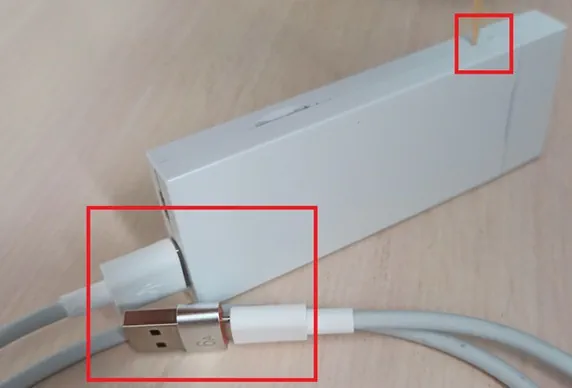

The stick will open the door for ~2 seconds so you could find unknown device in Device Manager.

### Install Drivers & Flash Tool

In Device Manager select "Show Hidden Devices" and find new unknown device. Its properties should look something like this:

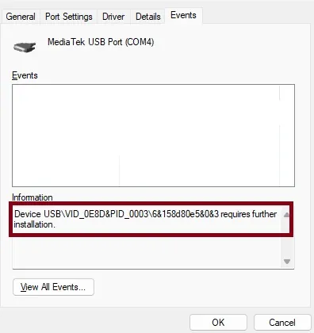

On your window the device is yet unknown, the key is to find VID like VID_0E8D to confirm the model.

1. For MediaTek device install the [driver](https://mtkdriver.com/install-mtk-driver)*.
2. Install [software](https://spflashtools.com/windows/sp-flash-tool-v5-2404) to perform read / write operations.
3. For MT6768 download the [preloader](resources/m88/preloader_tb8786p1_64_k419.bin)**. (Check its [sha512](resources/m88/sha512.txt)).
4. Download the [empty scatter](resources/m88/M88_empty_scatter.txt) file***.

\* *If your driver does not have digital signature read [this](https://photobyte.org/installing-unsigned-drivers-on-windows-10-or-11/).*

\** *Without a preloader you will not be able to write to and read from eMMC.
If the provided preloader does not fit then use [mtk client](https://github.com/bkerler/mtkclient) to get one:*

1. Install mtk client.
2. Open cmd in mtk client folder.
3. Type `mtk printgpt`.
4. Enter [BROM Mode](#enter-brom-mode).

You will get chip information, eMMC information and extracted preloader.

\*** *It is a markup file that gives information of where and what is placed on eMMC. 
Usually a program only needs to know where to begin reading / writing and for how long. 
Place the scatter and preloader in the same directory.*

### Read From eMMC
Open flash tool and choose **Download-Agent** and **Scatter**, see image below: 

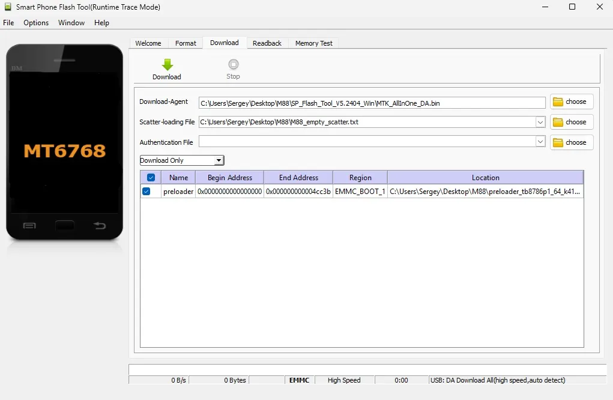

Perform read test to be sure that your preloader and chip model is appropriate. It is safe
and if your device or preloader is not appropriate it just warns you without any consequences.
Note that **End Address** must be equal or be bigger than the size of your preloader, edit the scatter if you have unique one with different size:

`partition_size: 0x4cc3b`

Go to **Readback** tab, setup regions as shown in the image below, (check third checkbox to create a full backup), click **Read Back**
and connect your device as described in [Enter BROM Mode](#enter-brom-mode). You can also find BOOT1 [here](resources/m88/BOOT1), BOOT2 is the same.

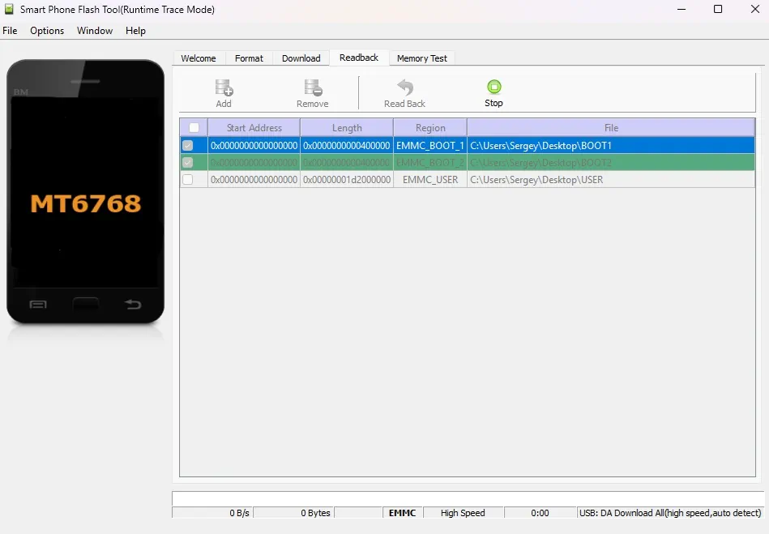

If operation fails your preloader / device model is different (popup should show you the actual chip model),
use *mtk client* as described above to get correct preloader and info about your device.

Use [7-zip](https://www.7-zip.org/download.html) to open your USER image, it will look like this:

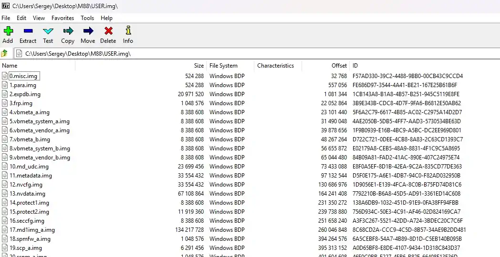

### Write to eMMC

1. Download, unpack and verify sha512 of [patched image](https://github.com/SergeyVorobiev/M88-GameStick-Patch/releases/download/v1.0.0/M88USER.7z).
2. Download the [scatter](resources/m88/M88_scatter.txt) file and use it instead of empty one. Place your 
preloader, scatter and patched image in the same folder.
3. Check the size of the image, edit if needed:
```
partition_size: 0x1d2000000
```
0x1d2000000 = 7818182656 bytes.

4. Open Flash Tool.

You have two options (both include **FORMATTING** the device).

Option one:
1. Select *Download* tab.
2. Select *Firmware Upgrade* in the dropdown list.
3. Tap *Download* button.
4. [Enter BROM Mode](#enter-brom-mode).
5. Done.

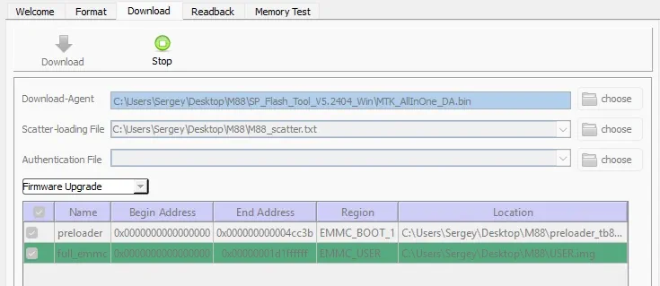

Option two:
1. Select *Format* tab.
2. Select *Format whole flash except Bootloader*.
3. Click *Start* button.

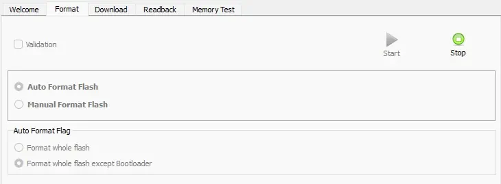

4. [Enter BROM Mode](#enter-brom-mode).
5. Select *Download* tab.
6. Select *Download Only* in the dropdown list.
7. Deselect *preloader*.
8. Tap *Download* button.
9. [Enter BROM Mode](#enter-brom-mode).
10. Done.

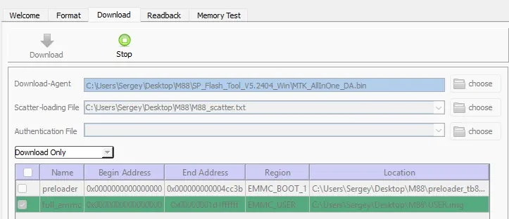

## RetroArch Setup
After upgrading, the stick will work in a default (set by manufacturer) mode. To use new features download 
[RetroArch archive](https://github.com/SergeyVorobiev/M88-GameStick-Patch/releases/download/v1.0.0/RetroArch.7z) 
and unpack it into root of your sd card. (sdcard/RetroArch).

What is inside:
1. **assets** folder. Menus and others.
2. **autoconfig** folder. Input configs.
3. **cheats** folder. Cheats for games.
4. **config** folder. Global shaders, remaps, platform / game configs, core configs.
5. **cores** folder. For new cores. Keep *sdcard/cores* folder untouched.
6. **database** folder. Game databases.
7. **downloads** folder. Downloaded or temp files.
8. **filters** folder. Audio / video filters.
9. **history** folder. History playlists etc.
10. **info** folder. Files describing each core.
11. **logs** folder. Logs.
12. **overlays** folder. Buttons on the screen.
13. **playlists** folder. Similar to history.
14. **shaders** folder. Shader programs.
15. **system** folder. BIOSes.
16. **temp** folder. Temporary files.
17. **thumbnails** folder. Art, screenshots etc.
18. **retroarch.cfg** file. Main file to control RetroArch behaviour.
19. **config.cfg** file. Auto-generated config.
20. **coremap.cfg** file. To reassign cores.
21. **n64core.cfg** file. To assign n64 core.

Some useful config variables:
```
input_enable_hotkey_btn - enable hot key
input_state_slot_decrease_btn - prev save slot
input_state_slot_increase_btn - next save slot
input_save_state_btn - save
input_load_state_btn - load
input_shader_toggle_btn - enable / disable shaders
input_fps_toggle_btn - enable / disable fps
menu_driver = "ozone" / "glui" / "rgui" / "xmb"
```

### Overriding Configs

You can override particular config parameters for specific platform or a game.

Example:
1. Create a config file `sdcard/RetroARch/config/Genesis Plus GX/Genesis Plus GX.cfg`.
2. Write inside the file `video_smooth = "true"`. 

Above parameter will override the default one for specific platform.

To override parameters for specific game create a config file with the name of game: `sdcard/RetroArch/config/Mupen64Plus-Next/Cruis n USA (USA) (Rev B).cfg`.


### SD Card Path

To form a path to sd card in the **retroarch.cfg** use a placeholder *externalSdCard* it will be replaced on real path:

```
input_remapping_directory = "externalSdCard/RetroArch/config/remaps"
```

It then will turn to something like:

```
input_remapping_directory = "/storage/F164-AC9C/RetroArch/config/remaps"
```

Note that the placeholder will not work in overridden config files, you have to use exact path like - /storage/F164-AC9C/... for
that. You can find the real path to your sd card in the auto-generated **config.cfg** file.

### Hotkeys

Assign activation button in config to enable hotkeys (assigned by default):

```
input_enable_hotkey_btn = "296" # select
```

Assign another key to some general option:

```
input_shader_toggle_btn = "299" # R3
```

*Select + R3* will disable / enable the default shader.

See [controller codes](resources/m88/Twin%20USB%20Joystick.cfg).

### Platform Controller
Mapping a controller can include up to 2 steps ([Controller codes](resources/m88/Twin%20USB%20Joystick.cfg)):

**real controller 1-> retro controller 2-> platform controller**

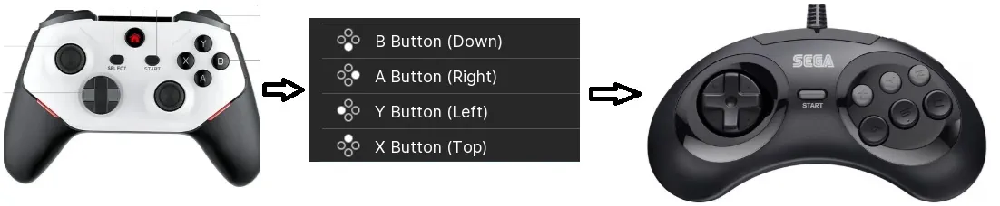

Usually all mappings happen automatically, but sometimes you want to change the default behaviour.

You are mapping the values of buttons of your physical controller to retro-pad using **retroarch.cfg** file, like:
```
input_b_btn = "289" or input_playerN_b_btn = "289" etc.
input_y_btn = "288"
input_select_btn = "296"
input_start_btn = "297"
input_l_btn = "292"
input_r_btn = "295"
input_l2_btn = "294"
input_r2_btn = "293"
...
```

We can see that X Y A B on our real controller are swapped comparing to retro controller Y X B A.

To map one to one manually, place next lines in retroarch.cfg:

```
input_player1_a_btn = "289" # B
input_player1_b_btn = "290" # A
input_player1_x_btn = "288" # Y
input_player1_y_btn = "291" # X
...
```
Now to map your retro controller to a game controller (Sega in this example):
1. Go to (or create set of folders) - *RetroArch\config\remaps\Genesis Plus GX*.
2. Inside the folder, put a file *Genesis Plus GX.rmp* with the content below:

```
input_libretro_device_p1 = "513" # 6 buttons
input_player1_analog_dpad_mode = "0"
input_remap_port_p1 = "0"
input_turbo_allow_dpad = "false"
input_turbo_bind = "-1"
input_turbo_button = "0"
input_turbo_duty_cycle = "0"
input_turbo_enable = "true"
input_turbo_mode = "0"
input_turbo_period = "6"

# Player 1
input_player1_btn_up = "4" #(sega up 4)
input_player1_btn_down = "5" #(sega down 5)
input_player1_btn_left = "6" #(sega left 6)
input_player1_btn_right = "7" #(sega right 7)

input_player1_btn_select = "2" #(sega mode 2)
input_player1_btn_start = "3" #(sega start 3)

input_player1_btn_y = "1" #(sega A 1)
input_player1_btn_a = "8" #(sega B 8)
input_player1_btn_b = "0" #(sega C 0)

input_player1_btn_l = "10" #(sega X 10) left shoulder
input_player1_btn_l2 = "10" #(sega X 10) duplicate for left trigger
input_player1_btn_x = "9" #(sega Y 9)
input_player1_btn_r = "11" #(sega X 11) right shoulder
input_player1_btn_r2 = "11" #(sega Z 11) duplicate for right trigger
```
Now you have:

```
Real X      = Sega A (Retro btn_y)
Real A      = Sega B (Retro btn_b)
Real B      = Sega C (Retro btn_a)
Real LB, LT = Sega X
Real Y      = Sega Y (Retro btn_x)
Real RB, RT = Sega Z
Real Select = Sega Mode
Real Start  = Sega Start
```

You can also create .rmp file with appropriate mapping via RetroArch quick menu:

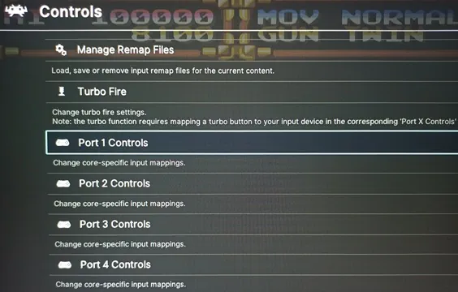

### Shaders
To assign global shader go to and open *sdcard/RetroArch/config/global.glslp* then set a reference - path to a global shader you want to use,
for example: `#reference "../shaders/shaders_glsl/xbr/xbr-lv3-multipass.glslp`. 
Shader can be disabled or enabled by using default hotkey - **select + r3**.
They are also accessible from the quick menu:

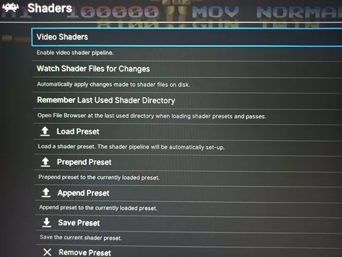

### Core settings
You can change settings for a specific core: 
`sdcard/RetroArch/config/SwanStation/SwanStation.opt` or for a particular game `sdcard/RetroArch/config/Mupen64Plus-Next/Cruis n USA (USA) (Rev B).opt`
or via the quick menu:

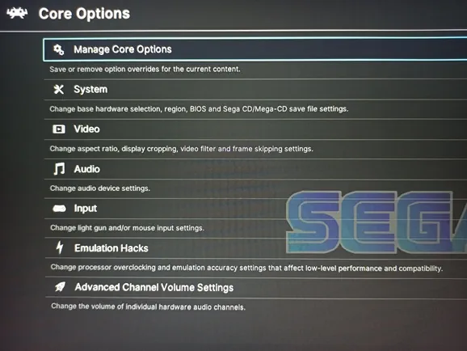

### Core mapping
You can override default core usage:

Open *sdcard/RetroArch/coremap.cfg* and add the line:

`pcsx_rearmed_libretro_android.so->swanstation_libretro_android.so`

psx games will use swanstation instead or rearmed.

To know which default core is used by a particular game, create a file *sdcard/RetroArch/logs/debug* then
whenever a game starts the system creates a file with rom's name and a core's name in *sdcard/RetroArch/logs* folder.

To assign specific core for N64 platform set a name of core in *sdcard/RetroArch/n64core.cfg* like: `parallel_n64_libretro_android.so`

If *sdcard/RetroArch/n64core.cfg* does not exist, the default mupen64 will start.

*All cores must exist in sdcard/RetroArch/cores folder.*

### Game Won't Start

If you see a black screen or a game crashes at the start don't immediately blame the stick or the firmware. 
1. Make sure the core you are using is suitable for running that game (not every core can emulate every possible game on a given platform).
2. Try to start the game with a different core (see [core mapping](#core-mapping)).
3. Download a fresh copy of the ROM and replace the old one.
4. Check that there are no temporary files left over from another core*.

\**For example: Metal Slug was working perfectly fine on MAME or FBA Alpha 2012 but ceased working on FB Neo. Go to sdcard/roms/cps1 and
delete the files: mslug.fs, mslug.state, mslug.tcxs then start the game again - it now starts on FB Neo.*

## Adding / Removing / Replacing Games

To add a game place the ROM file into the *sdcard/roms* folder. The stick does not automatically scan* the roms folder for changes,
hence you must register any changes manually. 

\* *Actually the stick will scan and rebuild the database if it could not find it on sdcard, but it is
a long process and requires having actual xml files in the appropriate game's folders.*

Need for Speed Carbon example (PSP):
1. Download the ROM: Need for Speed - Carbon - Own the City (USA).chd.
2. Download an appropriate image: NFSCarbon.png.
3. Place the ROM in *sdcard/roms/psp*.
4. Place the image in *sdcard/roms/psp/images*.

Now you need to register the game in the database so the launcher can see it:
1. Download and install [DB Browser](https://sqlitebrowser.org/dl/).
2. Open the program and drag & drop *sdcard/cachegames.db* file in it.
3. Select **Browse Data** tab.
4. Remember PSP **id** - 2. Add a 1 in the **total** cell (153 + 1 = 154, your number may differ), it's total number of games in PSP category.

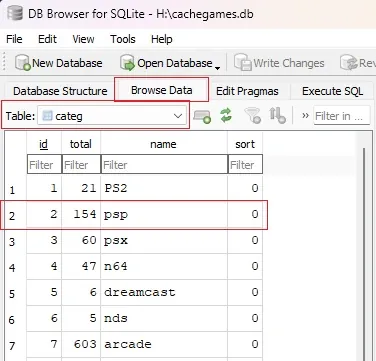

5. Select **game** table.
6. Add new row.
   * **id** PSP = 2
   * **gameid** the highest game id + 1. Tap on **gameid** column to sort it and see the highest number. 
   * **path** - The name of ROM (Need for Speed - Carbon - Own the City (USA).chd or your own).
   * **image** - The path to image (image/NFSCarbon.png or your own).
   * **class_type** - -15, search the correct number at any game with the same platform.
   * **game_type** - 0, search the correct number at any game with the same platform.
   * 4 columns with the game name (any name that suits you - NFS Carbon).
   * **name** - leave empty.
   * **fav** - 0, not favorite / favorite = 0 / 1.
   * **gnum** - use **gameid**.
   * **his** - 0.
   * **sort** - 0.
7. Click save and close.

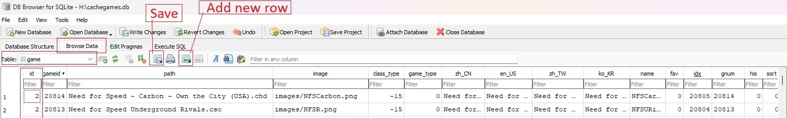

The game is now registered and will appear in PSP game list.

To remove - delete an appropriate row from **game** table, decrease the number of games for a specific platform 
in **categ** table and delete ROM / image files.

To replace - edit an appropriate row, you only need to change **path**, **image** and 4 name cells, then delete / add according ROM / image files.

## Graphic Settings

### PSP

```
Backend                             OpenGL
Rendering resolution                4x PSP
Display resolution                  Native device resolution
Fullscreen                          Off
Frame skipping type                 Percent of FPS
Auto frameskip                      On
Disable culling                     Off
Skip GPU Readbacks                  Skip
Lazy texture caching                On
Spline/Bezier curves quality        Low
Buffer graphics commands            Up to 1
Hardware transform                  On
Software skinning                   Off
Hardware tessellation               Off
Upscale type                        Bicubic
Upscale level                       Off
Deposterize                         Off
Anizotropic filtering               0x - 4x
Texture filtering                   linear / auto
Smart 2D texture filtering          On
Lower resolution for effectes       Aggressive
```

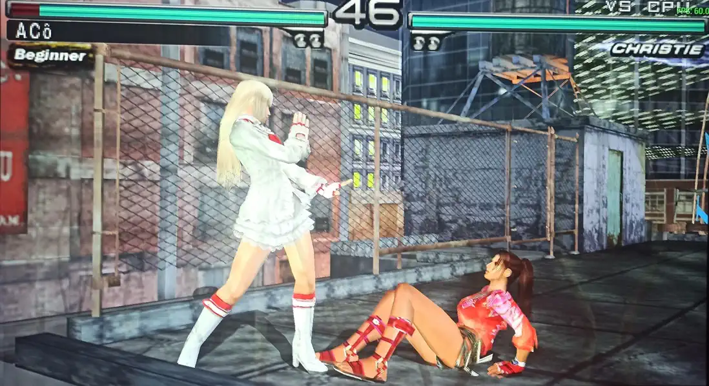

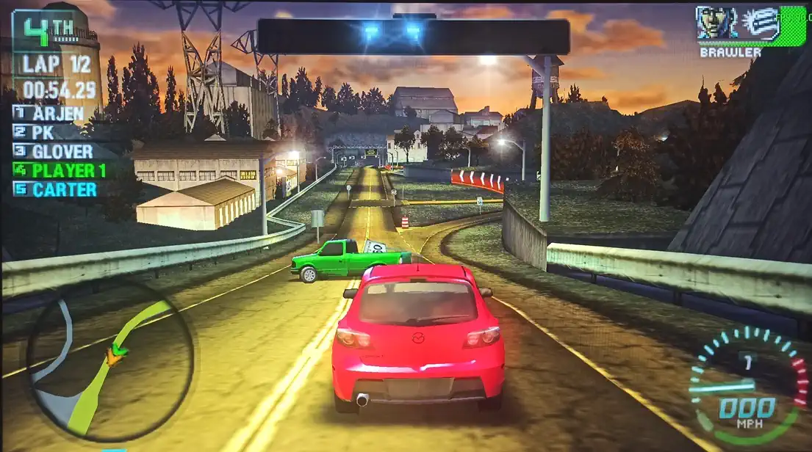

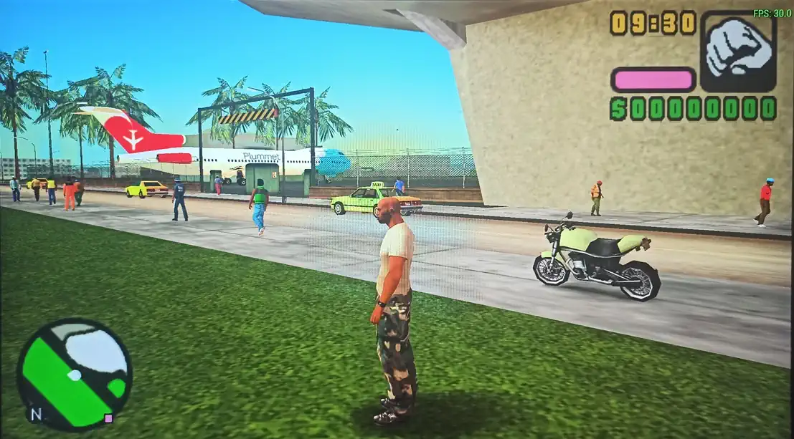

### Naomi & DreamCast

```
Graphics API                         Vulkan
Transparent Sorting                  Per Triangle
Internal Resolution                  1280x960 / 1600x1200
VSync                                Off
Full Framebuffer Emulation           Off
Load Custom Textures                 Off
Automatic Frame Skipping             Maximum
Shadows                              Off
Fog                                  Off
Delay Frame Swapping                 Off
Fix Upscale Bleeding Edge            On / Off
Native Depth Interpolation           Off
Copy Rendered Textures to VRAM       Off
Anisotropic Filtering                0x - 4x
Texture Filtering                    Force Linear / (Default - if artefacts)
Texture Upscaling                    1x in (3d) / up to 4x in 2d (fightings)
Texture Max Size                     256
Max Threads                          4
```

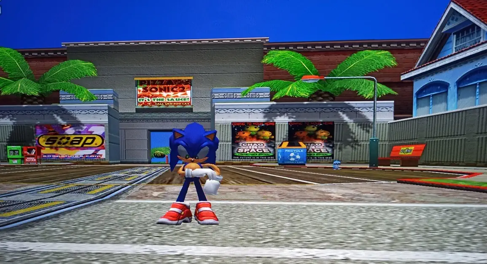

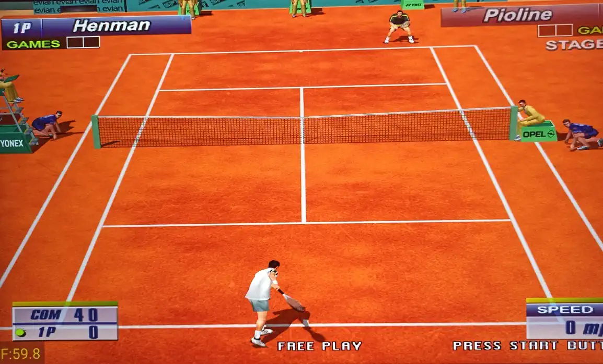

### RetroArch

Core settings for RetroArch platforms: `sdcard/RetroArch/config`.


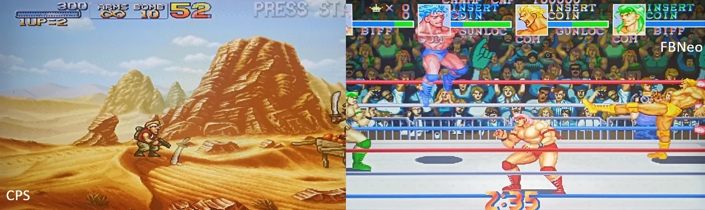

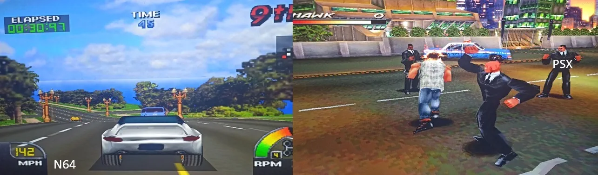

## Scripts

Repo has scripts for packing / unpacking / editing images. Examples can be seen [here](src/Main.py). Some scripts use
linux-like programs:

1. Install [Cygwin](https://www.cygwin.com/). (It will allow you to invoke many linux-like programs in your cmd, avoiding using WSL, VMWare etc.).
2. Add PATH to use cygwin programs from any place in your cmd:
   * `path_to\cygwin64\bin`
   * `path_to\cygwin64\sbin`
   * `path_to\cygwin64\usr\sbin`
3. Look for necessary programs [here](https://cygwin.com/packages/) if they missed.

For manual image unpacking you can use [7-zip](https://www.7-zip.org/download.html).

To compile / decompile apks use [apktool](https://apktool.org/). Be sure you have [JDK](https://adoptium.net/).

To pack / unpack boot (kernel, ramdisk, dtb) use [magiskboot](https://github.com/alitekin2fx/magiskboot).

Example:

Download repo and place an image of your stick (USER.img) or some android image and put it [here](src/img/original).
Depending on the android version it can contain vbmeta.img, super.img, ... inside or just system.img (old versions).
super.img usually contains system.img, vendor.img, system_ext.img, product.img.

To unpack USER.img:

```
MainSystemTool.unpack_partitions("img/original/USER.img", "img/original/extracted")
```

To unpack Super.img:

```
SuperTool.lpunpack_image("img/original/extracted/45.super.img", "img/original/extracted/super")
```

To check footer:

```
AVBInfo.print_info_image("img/original/extracted/super/system_a.img")
```
You can try some predefined commands to update a footer [here](src/CMDAVBToolExecutor.py), it is better to disable checks
to not mess with this if it is possible.

To unpack ext4 image:

```
Ext4UnpackTool.unpack("img/original/extracted/super/system_a.img", "img/original/extracted/super/system")
```

To decompile some apk:

```
apk_tool = APKTool()
apk_tool.decompile_into('img/updated/d_apk/emu', 'img/original/extracted/super/system/system/app/emu/emu.apk')
```

To search strings:

```
OtherTool.find_strings('img/updated/d_apk/emu/lib/armeabi-v7a/libEngine.so', grep="am start")
```

Compile apk file and sign automatically by predefined key for debugging or game sticks.

```
apk_tool.compile_and_sign('img/updated/d_apk/emu', 'img/updated/apk/emu.apk')
```

Removing / adding files from ext4 images:

```
modify_tool = Ext4ModifyTool("img/updated/system_a.img")
modify_tool.remove_file("system/app/emu/emu.apk")
modify_tool.remove_file("system/app/emu/oat/arm/emu.odex")
modify_tool.remove_file("system/app/emu/oat/arm/emu.vdex")
modify_tool.add_file('img/updated/apk/emu.apk', 'system/app/emu/emu.apk')
```

It is possible to create the hierarchy of files and folders in [res](src/res) folder as root and mirror it in the image:

```
# Mirror everything to system_a.img with exact
# hierarchy from default res or specified folder.
modify_tool.mirror_files()
```

Images with untouched size is preferable to just inject:

```
offset = SuperTool.get_partition_offset("img/original/extracted/45.super.img", "system_a")
OtherTool.inject("img/updated/system_a.img", "img/updated/45.super.img", offset)
```

To unpack kernel and ramdisk:

```
magiskboot = MagiskbootTool()
magiskboot.unpack_boot("img/original/extracted/23.boot_a.img", "img/updated/boot")
magiskboot.unpack_ramdisk("img/updated/boot/ramdisk.cpio", "img/updated/boot")
```

To pack ramdisk:

```
magiskboot.pack_ramdisk("img/updated/boot/cpio", "img/updated/boot/ramdisk", "img/updated/boot/ramdisk.cpio")
```

To pack ramdisk, kernel, dtb to boot:

```
magiskboot.pack_boot("img/original/extracted/23.boot_a.img", "img/updated/boot", "img/updated/23.boot_a.img")
```

To inject super back to main image:

```
offset = MainSystemTool.find_offset("img/updated/USER.img", "45.super.img")
OtherTool.inject("img/updated/45.super.img", "img/updated/USER.img", offset)
```
To resize an image:

```
modify_tool = Ext4ModifyTool("img/updated/system_a.img")
modify_tool.resize_img('+500M')
```

After resizing an image you can't just inject it in super image you have to use lpmake, see
implementation of this method as an example:

```
SuperTool.pack_super_m88(product_a_path="img/original/extracted/super/product_a.img",
                         product_b_path="img/original/extracted/super/product_b.img",
                         system_a_path="img/updated/system_a.img",
                         system_b_path="img/original/extracted/super/system_b.img",
                         vendor_a_path="img/original/extracted/super/vendor_a.img",
                         vendor_b_path="img/original/extracted/super/vendor_b.img",
                         original_super_path="img/original/extracted/45.super.img",
                         result_super_path="img/updated/new_super.img")

```

[This class](src/RetroADB.py) is for running RetroArch or extracting its user/data ([abe](https://github.com/nelenkov/android-backup-extractor)) from a device supported adb. 

*Some code sketches and architectural explanations were provided by [](https://grok.com/)*


