# M88 Game stick patch

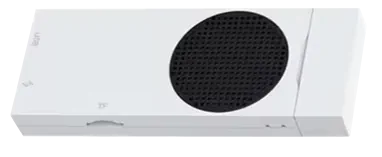

## Customization of [Helio P65](https://nanoreview.net/en/soc/mediatek-helio-p65) (MT6768) / [Helio G88](https://nanoreview.net/en/soc/mediatek-helio-g88) (MT8786) M88 Game Stick

## Table of Contents
1. [Introduction](#introduction)
   1. [The Problem](#the-problem)
   2. [Patch Overview](#patch-overview)
   3. [How To Fix](#how-to-fix)
   4. [Resources](#resources)
2. [Firmware Upgrade](#firmware-upgrade)
   1. [Enter BROM Mode](#enter-brom-mode)
   2. [Install Drivers & Flash Tool](#install-drivers--flash-tool)
   3. [Read From eMMC](#read-from-emmc)
   4. [Write To eMMC](#write-to-emmc)
3. [RetroArch Setup](#retroarch-setup)
   1. [Overriding Configs](#overriding-configs)
   2. [SD Card Path](#sd-card-path)
   3. [Hotkeys](#hotkeys)
   4. [Platform Controller](#platform-controller)
   5. [Shaders](#shaders)
   6. [Core Settings](#core-settings)
   7. [Core Mapping](#core-mapping)
   8. [Game Won't Start](#game-wont-start)
4. [Adding / Removing / Replacing Games](#adding--removing--replacing-games)
5. [Game DB Tool](#game-db-tool)
6. [Easter Eggs](#easter-eggs)
7. [Other Platforms](#other-platforms)
8. [Windows Emulation](#windows-emulation)
9. [Full House (Dolphin - Wii & GameCube / Citra - 3DS / RA64)](#full-house)
   1. [RetroArch64 Tips](#retroarch64-tips)
   2. [Citra Tips](#citra-tips)
   3. [Dolphin Tips](#dolphin-tips)
   4. [Controller Problems](#controller-problems)
10. [Third Party Controller Setup](#third-party-controller-setup)
    1. [GAMESIR NOVA 2 LITE Setup](#gamesir-nova-2-lite-setup)
    2. [Custom Controller Setup](#custom-controller-setup)
    3. [RetroArch Controller Setup](#retroarch-controller-setup) 
11. [Graphic Settings](#graphic-settings)
12. [Scripts](#scripts)
13. [Contact](#contact)

## Introduction

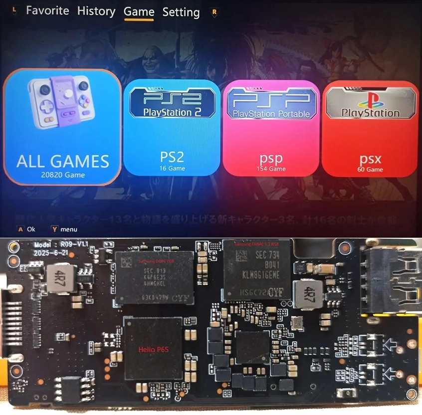

M88 is a Chinese game-stick which comes with a locked-down system, unfinished features and deceptive marketing. 
It has no cooling and may overheat quickly in 3D games.

Hardware:

1. [Helio P65](https://nanoreview.net/en/soc/mediatek-helio-p65) / [Helio G88](https://nanoreview.net/en/soc/mediatek-helio-g88) chipset (12x11mm).
2. [eMMC 5.1 8GB](https://semiconductor.samsung.com/estorage/emmc/emmc-5-1/klm8g1geme-b041/) or similar (13x11mm).
3. [DDR4 16Gb d / 2GB](https://semiconductor.samsung.com/dram/lpddr/lpddr4/k4f6e3s4hm-ghcl/) or similar (15x10mm).

SD Card:

```
1.  Alarms            - Android garbage.                    [can be deleted]
2.  Android           - Android garbage.                    [can be deleted]
3.  Audiobooks        - Android garbage.                    [can be deleted]
4.  DCIM              - Android garbage.                    [can be deleted]
5.  Documents         - Android garbage.                    [can be deleted]
6.  Download          - Android garbage.                    [can be deleted]
7.  LOST.DIR          - Android garbage.                    [can be deleted]
8.  Movies            - Android garbage.                    [can be deleted]
9.  Music             - Android garbage.                    [can be deleted]
10. Pictures          - Android garbage.                    [can be deleted]
11. Podcasts          - Android garbage.                    [can be deleted]
12. Notifications     - Android garbage.                    [can be deleted]
13. Recordings        - Android garbage.                    [can be deleted]
14. Ringtons          - Android garbage.                    [can be deleted]
15. .res              - Garbage.                            [can be deleted]
16. loading           - Garbage.                            [can be deleted]
17. skin              - Garbage.                            [can be deleted]
18. sound             - Garbage.                            [can be deleted]
19. BOOTEX.LOG        - Garbage.                            [can be deleted]
20. param             - Garbage.                            [can be deleted]
21. parameter         - Garbage.                            [can be deleted]
22. volctrl           - Garbage.                            [can be deleted]
23. .bright           - Brightness.                         [can be deleted]
24. .vol              - Volume.                             [can be deleted]
25. controls.ini      - PSP control mapping.                [can be deleted]
26. data.pud          - Set of SWFs for main app, not used. [can be deleted]
27. sdcard            - SD card marker.                     [can be deleted]
28. PSP               - PSP configs.                        [can be deleted]
29. org.ppsspp.ppsspp - PSP emulator configs.               [can be deleted]
30. cores             - Cores for RetroArch.
31. gamesettings      - PS2 configs
32. iroms             - Icons and BGs for main interface.
33. n64res            - Mupen emulator configs.
34. ps2bios_          - PS2 BIOS.
35. roms              - Game ROMs.
36. shared_prefs      - Drastic emulator configs.
37. shared_prefs_ps2  - PS2 configs.
38. cachegames.db     - Database of all registered games.
39. cheat.db          - Cheat database.
40. font.fts          - Font for main application.
```

The manufacturer claims PS2 emulation, but with P65 chipset + only 2GB RAM + lack of cooling it's basically unplayable.

This guide shows how to upgrade M88 firmware which allows:

1. Button mapping (RealPad->RetroPad).    
2. Setup hotkeys.
3. Change controller behaviour (RetroPad->PlatformPad).
4. Install latest cores.
5. Remap cores.
6. Change core settings.
7. Enable shaders.
8. Unlock multiple save / load slots.
9. Missed BIOSes fixed.
10. Standard RetroArch menu with settings.
11. Replace mupen64plusae to RetroArch (optionally).
12. Fix single audio channel output. Since v2.2.

Since v2.3:
13. Full control via TotalCommander.
14. RetroArch64 full support.
15. Citra (3DS) emulator support.
16. Dolphin (Wii / GameCube) emulator support.
17. Upgrade AetherSX to NetherSX.
18. Fix wrong screen density.
19. Fix controller keycodes.
20. Main menus for Nether / Yaba / DraStic / N64.
21. Aida / CpuZ.

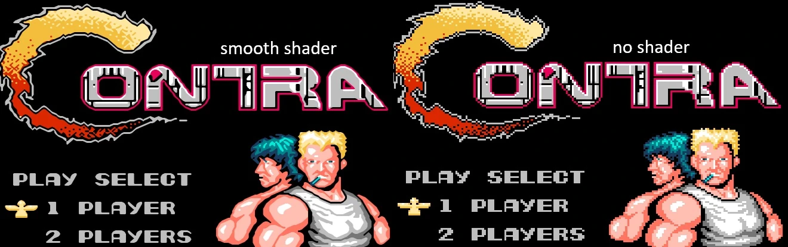


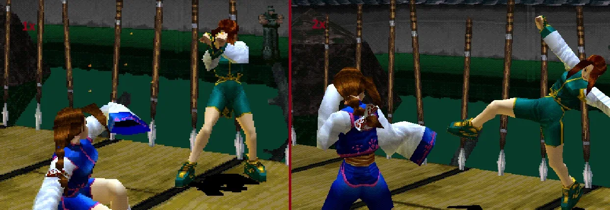

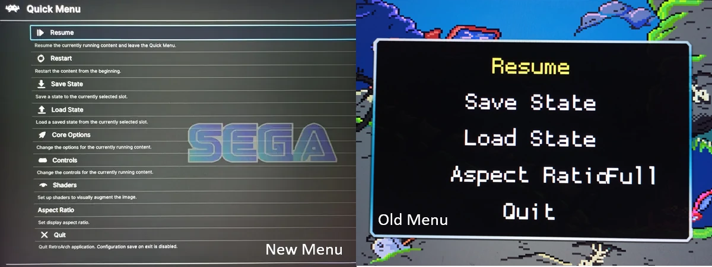

List of platforms:

```
                                                    [Quality]*
1.  PS2             - aethersx2 []                  [Awful]
2.  PSP             - ppsspp    []                  [Awesome]
3.  PSX             - RetroArch [swanstation]       [Meh]     [BIOS ok] (default ReARMed)
4.  Nintendo64      - mupen/RA  [parallel_n64]      [Awesome] [BIOS ok]
5.  Dreamcast       - Flycast   []                  [Awesome]
6.  NintendoDS      - Drastic   []                  [Good]
7.  Arcade Classic  - RetroArch [FB Alpha 2012]     [Meh]     [BIOS ok]
8.  SFC             - RetroArch [Snes9x]            [Awesome] [BIOS ok]
9.  SNES            - RetroArch [Snes9x]            [Awesome] [BIOS ok]
10. Atari7800       - RetroArch [ProSystem]         [Meh]     [BIOS ok]
11. AtariLynx       - RetroArch [Handy]             [Meh]     [BIOS ok]
12. CPS1            - RetroArch [FB Alpha 2012]     [Awesome] [FB Neo] [BIOS ok]
13. CPS2            - RetroArch [FB Alpha 2012]     [Awesome] [FB Neo] [BIOS ok]
14. CPS3            - RetroArch [mame2016]          [Meh]     [FB Alpha 2012, FB Neo, mame2010]
15. FbNeo           - RetroArch [FB Alpha 2012]     [Awesome] [FB Neo] [BIOS ok]
16. GameGear        - RetroArch [Genesis Plus GX]   [Good]    [BIOS ok]
17. GB              - RetroArch [mGBA]              [Meh]     [BIOS ok]
18. GBA             - RetroArch [mGBA]              [Meh]     [BIOS ok]
19. GBC             - RetroArch [mGBA]              [Meh]     [BIOS ok]
20. Genesis         - RetroArch [Genesis Plus GX]   [Awesome] [BIOS ok]
21. MAME            - RetroArch [MAME 2003-Plus)    [Meh]     
22. MegaDrive       - RetroArch [Genesis Plus GX)   [Awesome] [BIOS ok]
23. Atari2600       - RetroArch [Stella]            [Meh]   
24. Nes             - RetroArch [Nestopia]          [Awesome] [BIOS ok]
25. Nesh            - RetroArch [Nestopia]          [Awesome] [BIOS ok]
26. NGPC            - RetroArch [Beetle NeoPop]     [Meh]     [BIOS ok] (*Beetle NeoPop=mednafen_ngp)
27. PCEngine        - RetroArch [Beetle PCE Fast]   [Good]    [BIOS ok] (*Beetle=mednafen)
28. Wonderswan      - RetroArch [Beetle WonderSwan] [Meh]     [BIOS ok] (*Beetle=mednafen)
29. WonderswanColor - RetroArch [Beetle WonderSwan] [Meh]     [BIOS ok] (*Beetle=mednafen)
30. GBAH            - RetroArch [mGBA]              [Good]    [BIOS ok]
31. GenH            - RetroArch [Genesis Plus GX]   [Good]    [BIOS ok]
32. Mastersystem    - RetroArch [Genesis Plus GX]   [Awesome] [BIOS ok]
33. Naomi           - Flycast   []                  [Awesome]
34. NGP             - RetroArch [Beetle NeoPop]     [Meh]     [BIOS ok] (*Beetle NeoPop=mednafen_ngp)
35. PCEngineCD      - RetroArch [Beetle PCE Fast]   [Good]    [BIOS ok] (*Beetle=mednafen)
36. Atari5200       - RetroArch [a5200]             [Meh]     [BIOS ok]
-----------------------------------------------------------------------
37. Sega Saturn     - YABA SANSHIRO                 [Good]
38. MS-DOS          - RetroArch [DosBox Pure]       [Awesome]
```

\**Subjective opinion based on games graphic / render speed.*

### The Problem

The libEngine.so library of emu.apk (the main 'carousel') has hardcoded "start game" commands:
```
am start --user 0 -n org.mupen64plusae.v3.alpha/paulscode.android.mupen64plusae.SplashActivity -d "file://%s" --activity-clear-top
am start --user 0 -n org.devmiyax.yabasanshioro2.pro/org.uoyabause.android.Yabause -e org.uoyabause.android.FileNameEx "%s" -e org.uoyabause.android.gamecode gamename 
am start --user 0 -n com.flycast.emulator/com.reicast.emulator.NativeGLActivity -d "%s" --activity-clear-top
am start --user 0 -n xyz.aethersx2.android/xyz.aethersx2.android.EmulationActivity -a android.intent.action.MAIN -e bootPath "%s" --activity-clear-top
am start --user 0 -n com.emu/org.ppsspp.ppsspp.PpssppActivity -d "file://%s" --activity-clear-top
am start --user 0 -n com.dsemu.drastic/com.dsemu.drastic.DraSticActivity -d "file://%s" --activity-clear-top
am start --user 0 -n com.emu/.browser.retroactivity.RetroActivityFuture -e ROM "%s"  -e LIBRETRO %s -e CONFIGFILE /system/res/zip.cfg -e SDCARD /sdcard -e EXTERNAL %s --activity-clear-top
am start --user 0 -n com.emu/.browser.retroactivity.RetroActivityFuture -e ROM "%s"  -e LIBRETRO %s -e CONFIGFILE /system/res/psxzip.cfg -e SDCARD /sdcard -e EXTERNAL %s --activity-clear-top
```

***org.devmiyax.yabasanshioro2.pro*** - Sega Saturn? Yes, see [Easter Eggs](#easter-eggs).

[RetroArch](https://www.retroarch.com/) runs games for most of the platforms with predefined configs (psxzip.cfg for PSX and zip.cfg for others) hidden in system image on eMMC.

The old RetroArch has a custom menu with cut options. As a result:

1. No core settings.
2. No controller settings. (It is impossible to play some games: Lost vikings, Duke Nukem etc.).
3. No hotkeys.
4. No shaders.
5. Only single save / load slot for RetroArch platforms.
6. No ability to reset a game.
7. No ability to update cores.
8. No ability to choose a core for a particular platform.
9. PSX running on old Rearmed core (1x upscale, software rendering).
10. N64 running on mupen64plus with zero menu settings.

### Patch Overview

The fixes include:
1. Patching ramdisk to disable verifications.
2. Patching RetroArch32 1.22.2 to auto-install cores.
3. Installing RetroArch32 1.22.2*.
4. Patching privileges for RetroArch32 1.22.2 to acquire read / write permissions automatically.
5. Patching emu.apk to assemble config and redirect game launching to RetroArch32 1.22.2.
6. Moving all RetroArch data to the external SD card for customization.
7. Patching mupen64plusae to redirect game launching to RetroArch32 1.22.2 (optionally).
8. Patching audio config to fix only left channel sound issue (Stereo sound fix, since v2.2).
9. Adding Dolphin, Citra, RetroArch64 emulators (since v2.3). 
\**RetroArch32 quick menu will show 1.19 but games will run under the 1.22.2.*

> [!NOTE]
> 
> If you want full control plus Dolphin, Citra, RetroArch64 support, please carefully read [this paragraph](#full-house)
> after performing the upgrade.

### How To Fix

> [!WARNING]  
> Firmware upgrade might potentially brick your device, do it at your own risk, always make a backup to be able to roll back.

There are three options, all of them imply you have M88-P65-V1.8, but they do not guarantee a success if your stick has different hardware / software.

Option one is to replace the whole USER area on the eMMC of your stick on [the provided one](https://github.com/SergeyVorobiev/M88-GameStick-Patch/releases/latest/download/USER_v2.3.7z):
1. Upgrade the firmware ([Firmware Upgrade](#firmware-upgrade)).
2. Put RetroArch folder on your SD card. ([RetroArch Setup](#retroarch-setup)).
3. Read [Game Won't Start](#game-wont-start).

Option two is the same, but you have to make an upgraded image from your original one to use it instead of provided one. 
It also gives a better chance of success:

1. Read [this](#firmware-upgrade) to just make a backup.
2. Download and unpack this [archive](https://github.com/SergeyVorobiev/M88-GameStick-Patch/releases/latest/download/M88FW.7z), password: m88.
3. Download [GDBTool](https://github.com/SergeyVorobiev/M88-GameStick-Patch/releases/latest/download/M88GDBTool_1.9.exe).
4. Put these three files next to each other:

    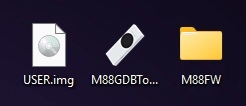

5. Open GDBTool, click **Upgrade Firmware** button, then **Start** and wait until it finishes.

    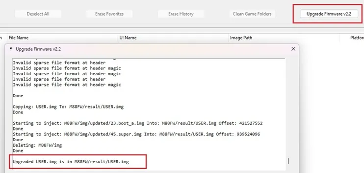

6. Perform steps from *Option one* but use the upgraded image from *M88FW/result/USER.img*.

In option three you use scripts to make an upgraded image:  

1. Read [this](#firmware-upgrade) to just make a backup.
2. Read and perform steps from [Scripts](#scripts) paragraph by using your backup.
3. Perform steps from *Option one* but use your own *USER.img* generated on step 2 instead of provided one.

If nothing works, feel free to [contact me](#Contact).

### Resources

1. Official latest [RA cores](https://buildbot.libretro.com/nightly/android/latest/armeabi-v7a/).
2. Official latest [RA64 cores](https://buildbot.libretro.com/nightly/android/latest/arm64-v8a/).
3. 32x Cores' [backup](https://1drv.ms/u/c/28d6b1fe696eddef/IQCsbMkF_SXWS7yB4WNzuxTTAU-g4nF-Kn7NkSBCxn8Rfmc?e=34dujr) january 2026. (password: m88)
4. Stick's default cores [backup](https://drive.google.com/file/d/1gzb0hgsq3L2E9TT9_wZ0WJxhM8gKAOJj/view?usp=drive_link)*.
5. [RetroArch folder](https://github.com/SergeyVorobiev/M88-GameStick-Patch/releases/latest/download/RetroArch_v2.3.7z).
6. [M88 upgraded image](https://github.com/SergeyVorobiev/M88-GameStick-Patch/releases/latest/download/USER_v2.3.7z).
7. DIY variant of [cooling](https://www.youtube.com/watch?v=RwfFUWYsOH8).
8. SD card contents, 128GB [variant](https://archive.org/details/m88-ps2-game-stick-backup-august2025).
9. [M88GDBTool](https://github.com/SergeyVorobiev/M88-GameStick-Patch/releases/latest/download/M88GDBTool_1.9.exe).
10. [BoxArts](https://thumbnails.libretro.com/).

\* *New cores are contained in RetroArch folder only for upgraded firmware.*

## Firmware Upgrade

Steps bellow are intended for M88 sticks based on MediaTek Helio P65 / G88 chipset. If you have different processor model your steps will be similar,
but drivers and tools must be replaced to suit your chip.

> [!NOTE]  
> If your processor is not Helio P65 / G88, neither patched image nor patched files from the scripts are appropriate
> as they have updated parts related only to mt6768 / mt8786. Use information below only for your own experiments.

The stick supports only **BROM mode** (Boot ROM mode is a low-level mode that allows reading/writing the eMMC flash).

### Enter BROM Mode
1. Prepare a cable USB-A <-> USB-A (you can use common USB-C phone cable + adapter USB-C to USB-A)
2. Prepare a toothpick (To press the 'upgrade' button in the hole of the stick).
3. Remove dongle from the stick to insert the cable in it.
4. Connect one end of the cable to your laptop / computer.
5. Push the button in the stick's hole with a toothpick and hold.
6. Connect the other end of the cable into dongle's socket.
7. Release the 'upgrade' button after the connection is established.

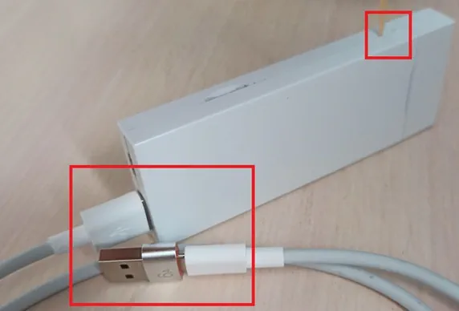

The stick will open the door for ~2 seconds so you could find unknown device in Device Manager.

### Install Drivers & Flash Tool

In Device Manager select "Show Hidden Devices" and find new unknown device. Its properties should look something like this:

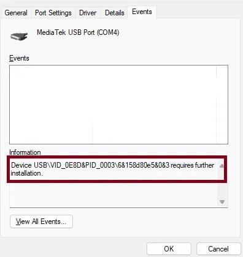

On your window the device is yet unknown, the key is to find VID like VID_0E8D to confirm the model.

1. For MediaTek device install the [driver](https://mtkdriver.com/install-mtk-driver)*.
2. Install [software](https://spflashtools.com/windows/sp-flash-tool-v5-2404) to perform read / write operations.
3. For MT6768 download and unpack the scatter** and the preloader*** from [here](https://github.com/SergeyVorobiev/M88-GameStick-Patch/releases/latest/download/Preloader_Scatter.7z). (Check preloader's [sha512](resources/m88/sha512.txt)).

\* *If your driver does not have digital signature read [this](https://photobyte.org/installing-unsigned-drivers-on-windows-10-or-11/).*

\** *It is a markup file that gives information of where and what is placed on eMMC. 
Usually a program only needs to know where to begin reading / writing and for how long. 
Place the scatter and preloader in the same directory.*

\*** *Without a preloader you will not be able to write to and read from eMMC.
If the provided preloader does not fit then use [mtk client](https://github.com/bkerler/mtkclient) to get one:*

1. Install mtk client.
2. Open cmd in mtk client folder.
3. Type `mtk printgpt`.
4. Enter [BROM Mode](#enter-brom-mode).

You will get chip information, eMMC information and extracted preloader in the mtk client root folder.

### Read From eMMC

> [!WARNING]
> This operation is mandatory, as only your backup can get your device back to life if it becomes bricked. **Please, Do Not Skip This Step.**

> [!CAUTION]
> If you have some problems with 'Read Back' operation in SP Flash Tool, please don't continue! Either contact me or 
> give up. Some sticks may have 4GB eMMC variant instead of 8GB, that will be clear if you could not perform the operation
> with the standard region sizes. Attempting to perform an upgrade on 4GB eMMC device will brick it 100%.
> Contacting me after you've bricked the device without a proper backup is pointless.

Open flash tool and choose **Download-Agent** and **Scatter**, see image below: 

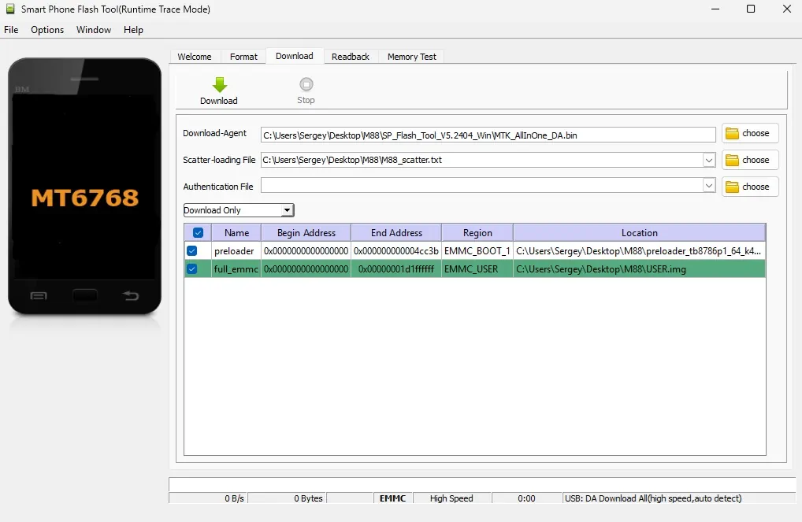

Go to **Readback** tab, setup regions as shown in the image below, click **Read Back**
and connect your device as described in [Enter BROM Mode](#enter-brom-mode).
```
Standard region sizes*:
EMMC_BOOT_1 - 0x000400000 =     4mb
EMMC_BOOT_2 - 0x000400000 =     4mb
EMMC_USER   - 0x1d2000000 =  7456mb
```
\* Use `mtk printgpt` command as mentioned above if you have any doubts about region sizes of your stick.

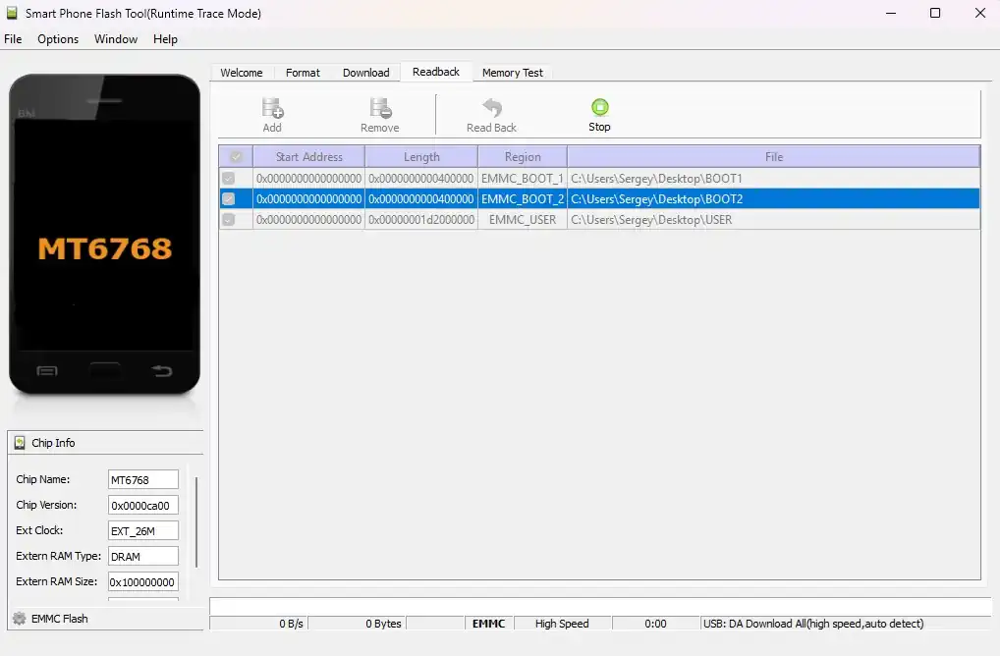

If operation fails your preloader / device model is different (popup should show you the actual chip model),
use *mtk client* as described above to get a correct preloader and info about your device.

If everything is ok, you will get BOOT1, BOOT2, USER files meaning that the driver and the software is appropriate to your SoC,
and you can try to upgrade the firmware. 

> [!NOTE]
> **Read Back** operation (as described above) is completely safe, you will not
lose anything even if something goes wrong. 

Use [7-zip](https://www.7-zip.org/download.html) to open your USER* image, it will look like this:

\* *You can add an extension .img - USER.img (could be useful to be correctly recognized by some software).*

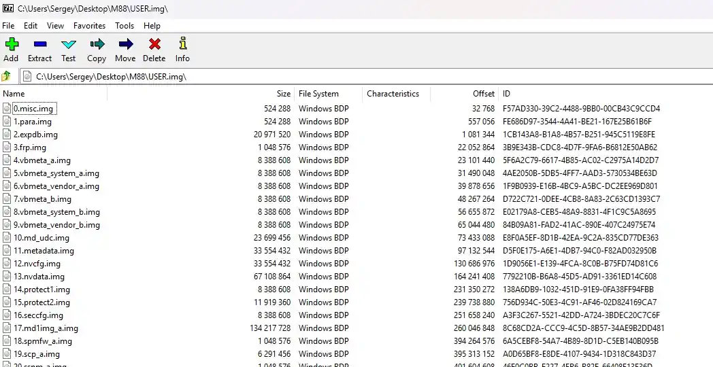

### Write to eMMC

1. Download, unpack and verify sha512 of [patched image](https://github.com/SergeyVorobiev/M88-GameStick-Patch/releases/latest/download/USER_v2.3.7z) or use your upgraded one.
2. Check the size of the image, edit if needed:
    ```
    partition_size: 0x1d2000000
    ```
    0x1d2000000 = 7818182656 bytes.

3. Open Flash Tool.

You have two options (both include **FORMATTING**). The first one is more preferable.

Option one:
1. Select *Format* tab.
2. Select *Format whole flash except Bootloader*.
3. Click *Start* button.

    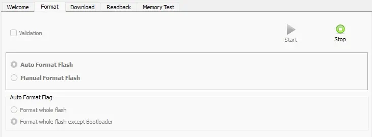

4. [Enter BROM Mode](#enter-brom-mode).
5. Select *Download* tab.
6. Select *Download Only* in the dropdown list.
7. Deselect *preloader*.
8. Tap *Download* button.
9. [Enter BROM Mode](#enter-brom-mode).
10. Congratulations, you've successfully flashed the stick.*

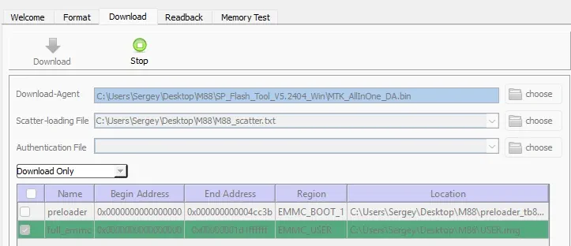

Option two (Use this one only with your own preloader gotten from `mtk printgpt` command):
1. Select *Download* tab.
2. Select *Firmware Upgrade* in the dropdown list.
3. Tap *Download* button.
4. [Enter BROM Mode](#enter-brom-mode).
5. Congratulations, you've successfully flashed the stick.*

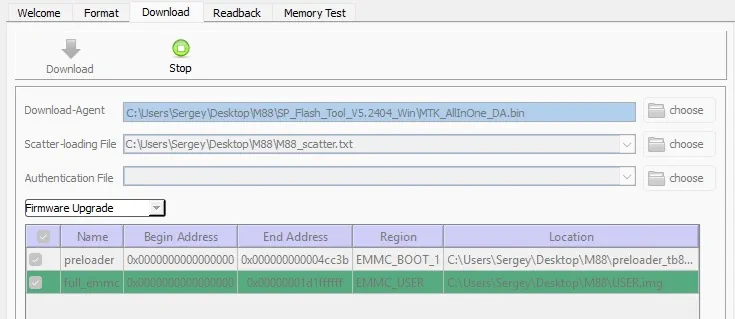

\* *Do not touch anything while the flashing is in progress, this may take several minutes.
If something goes wrong then try again or use the USER.img you backed up [earlier](#read-from-emmc).*

## RetroArch Setup
After upgrading, the stick will work in a default (set by manufacturer) mode. To use new features download 
[RetroArch archive](https://github.com/SergeyVorobiev/M88-GameStick-Patch/releases/latest/download/RetroArch_v2.3.7z) 
and unpack it into root of your sd card. (sdcard/RetroArch). The system will start in upgraded mode automatically while 
main RetroArch config file - *sdcard/RetroArch/retroarch.cfg* is presented.

What is inside:
1. **assets** folder. Menus and others.
2. **autoconfig** folder. Input configs.
3. **cheats** folder. Cheats for games.
4. **config** folder. Global shaders, remaps, platform / game configs, core configs.
5. **cores** folder. For new cores. Keep *sdcard/cores* folder untouched.
6. **database** folder. Game databases.
7. **downloads** folder. Downloaded or temp files.
8. **filters** folder. Audio / video filters.
9. **history** folder. History playlists etc.
10. **info** folder. Files describing each core.
11. **logs** folder. Logs.
12. **overlays** folder. Buttons on the screen.
13. **playlists** folder. Similar to history.
14. **shaders** folder. Shader programs.
15. **system** folder. BIOSes.
16. **temp** folder. Temporary files.
17. **thumbnails** folder. Art, screenshots etc.
18. **retroarch.cfg** file. Main file to control RetroArch behaviour.
19. **config.cfg** file. Auto-generated config.
20. **coremap.cfg** file. To reassign cores.
21. **n64core.cfg** file. To assign n64 core.

Some useful config variables:
```
input_enable_hotkey_btn - enable hot key
input_state_slot_decrease_btn - prev save slot
input_state_slot_increase_btn - next save slot
input_save_state_btn - save
input_load_state_btn - load
input_shader_toggle_btn - enable / disable shaders
input_fps_toggle_btn - enable / disable fps
menu_driver = "ozone" / "glui" / "rgui" / "xmb"
input_volume_down
input_volume_up
input_toggle_slowmotion - slow down a game
input_toggle_fast_forward - speed up a game
```

### Overriding Configs

You can override particular config parameters for specific platform or a game.

Example:
1. Create a config file `sdcard/RetroARch/config/Genesis Plus GX/Genesis Plus GX.cfg`.
2. Write inside the file `video_smooth = "true"`. 

Above parameter will override the default one for specific platform.

To override parameters for specific game create a config file with the name of game: `sdcard/RetroArch/config/Mupen64Plus-Next/Cruis n USA (USA) (Rev B).cfg`.


### SD Card Path

To form a path to sd card in the **retroarch.cfg** use a placeholder *externalSdCard* it will be replaced on real path:

```
input_remapping_directory = "externalSdCard/RetroArch/config/remaps"
```

It then will turn to something like:

```
input_remapping_directory = "/storage/F164-AC9C/RetroArch/config/remaps"
```

Note that the placeholder will not work in overridden config files, you have to use exact path like - /storage/F164-AC9C/... for
that. You can find the real path to your sd card in the auto-generated **config.cfg** file.

### Hotkeys

Assign activation button in config to enable hotkeys (assigned by default):

```
input_enable_hotkey_btn = "296" # select
```

Assign another key to some general option:

```
input_shader_toggle_btn = "299" # R3
```

*Select + R3* will disable / enable the default shader.

See [controller codes](resources/m88/Twin%20USB%20Joystick.cfg).

### Platform Controller
Mapping a controller can include up to 2 steps ([Controller codes](resources/m88/Twin%20USB%20Joystick.cfg)):

**real controller 1-> retro controller 2-> platform controller**

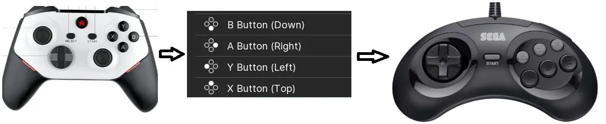

Usually all mappings happen automatically, but sometimes you want to change the default behaviour.

You are mapping the values of buttons of your physical controller to retro-pad using **retroarch.cfg** file, like this:
```
input_b_btn = "289" or input_playerN_b_btn = "289" etc.
input_y_btn = "288"
input_select_btn = "296"
input_start_btn = "297"
input_l_btn = "292"
input_r_btn = "295"
input_l2_btn = "294"
input_r2_btn = "293"
...
```

We can see that X Y A B on our real controller are swapped comparing to retro controller Y X B A.

To map one to one manually, place next lines in retroarch.cfg:

```
input_player1_a_btn = "289" # B
input_player1_b_btn = "290" # A
input_player1_x_btn = "288" # Y
input_player1_y_btn = "291" # X
...
```
Now to map your retro controller to a game controller (Sega in this example):
1. Go to (or create set of folders) - *RetroArch\config\remaps\Genesis Plus GX*.
2. Inside the folder, put a file *Genesis Plus GX.rmp* with the content below:

```
input_libretro_device_p1 = "513" # 6 buttons
input_player1_analog_dpad_mode = "0"
input_remap_port_p1 = "0"
input_turbo_allow_dpad = "false"
input_turbo_bind = "-1"
input_turbo_button = "0"
input_turbo_duty_cycle = "0"
input_turbo_enable = "true"
input_turbo_mode = "0"
input_turbo_period = "6"

# Player 1
input_player1_btn_up = "4" #(sega up 4)
input_player1_btn_down = "5" #(sega down 5)
input_player1_btn_left = "6" #(sega left 6)
input_player1_btn_right = "7" #(sega right 7)

input_player1_btn_select = "2" #(sega mode 2)
input_player1_btn_start = "3" #(sega start 3)

input_player1_btn_y = "1" #(sega A 1)
input_player1_btn_a = "8" #(sega B 8)
input_player1_btn_b = "0" #(sega C 0)

input_player1_btn_l = "10" #(sega X 10) left shoulder
input_player1_btn_l2 = "10" #(sega X 10) duplicate for left trigger
input_player1_btn_x = "9" #(sega Y 9)
input_player1_btn_r = "11" #(sega X 11) right shoulder
input_player1_btn_r2 = "11" #(sega Z 11) duplicate for right trigger
```
Now you have:

```
Real X      = Sega A (Retro btn_y)
Real A      = Sega B (Retro btn_b)
Real B      = Sega C (Retro btn_a)
Real LB, LT = Sega X
Real Y      = Sega Y (Retro btn_x)
Real RB, RT = Sega Z
Real Select = Sega Mode
Real Start  = Sega Start
```

You can also create .rmp file with appropriate mapping via RetroArch quick menu:

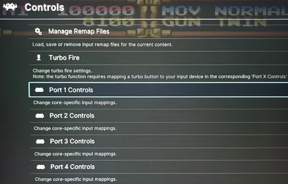

### Shaders
To assign global shader go to and open *sdcard/RetroArch/config/global.glslp* then set a reference - path to a global shader you want to use,
for example: `#reference "../shaders/shaders_glsl/xbr/xbr-lv3-multipass.glslp`. 
Shader can be disabled or enabled by using default hotkey - **select + r3**.
They are also accessible from the quick menu:

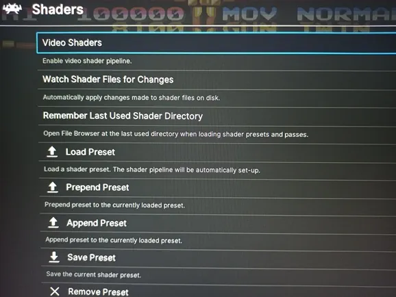

### Core settings
You can change settings for a specific core: 
`sdcard/RetroArch/config/SwanStation/SwanStation.opt` or for a particular game `sdcard/RetroArch/config/Mupen64Plus-Next/Cruis n USA (USA) (Rev B).opt`
or via the quick menu:

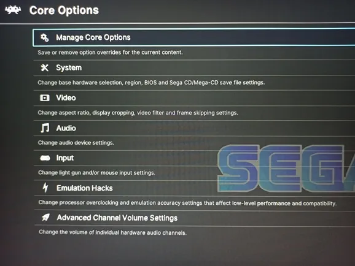

### Core mapping
You can override default core usage:

Open *sdcard/RetroArch/coremap.cfg* and add the line:

`pcsx_rearmed_libretro_android.so->swanstation_libretro_android.so`

psx games will use swanstation instead or rearmed.

To know which default core is used by a particular game, create a file *sdcard/RetroArch/logs/debug* then
whenever a game starts the system creates a file with rom's name and a core's name in *sdcard/RetroArch/logs* folder.

To assign specific core for N64 platform set a name of core in *sdcard/RetroArch/n64core.cfg* like: `parallel_n64_libretro_android.so`

If *sdcard/RetroArch/n64core.cfg* does not exist, the default mupen64 will start.

*All cores must exist in sdcard/RetroArch/cores folder.*

Since v2.1 you can reassign any core via a platform name not a core name, it's more preferable approach so as the same core might be used by several platforms.
The default core mapping for RetroArch platforms is:

```
psx->swanstation_libretro_android.so
arcade->mame2010_libretro_android.so
sfc->snes9x_libretro_android.so
snes->snes9x_libretro_android.so
atari7800->prosystem_libretro_android.so
atarilynx->mednafen_lynx_libretro_android.so
cps1->fbalpha2012_libretro_android.so
cps2->fbalpha2012_libretro_android.so
cps3->fbalpha2012_libretro_android.so
fbneo->fbneo_libretro_android.so
gamegear->gearsystem_libretro_android.so
gb->mgba_libretro_android.so
gba->mgba_libretro_android.so
gbc->mgba_libretro_android.so
genesis->genesis_plus_gx_libretro_android.so
mame->mame2010_libretro_android.so
megadrive->genesis_plus_gx_libretro_android.so
atari2600->stella_libretro_android.so
nes->nestopia_libretro_android.so
nesh->nestopia_libretro_android.so
ngpc->race_libretro_android.so
pcengine->mednafen_pce_fast_libretro_android.so
wonderswan->mednafen_wswan_libretro_android.so
wonderswancolor->mednafen_wswan_libretro_android.so
gbah->mgba_libretro_android.so
genh->genesis_plus_gx_libretro_android.so
mastersystem->genesis_plus_gx_libretro_android.so
ngp->race_libretro_android.so
pcenginecd->mednafen_pce_fast_libretro_android.so
atari5200->a5200_libretro_android.so
dos->dosbox_pure_libretro_android.so
```

### Game Won't Start

If you see a black screen or a game crashes at the start don't immediately blame the stick or the firmware. 
1. Make sure the core you are using is suitable for running that game (not every core can emulate every possible game on a given platform).
2. Try to start the game with a different core (see [core mapping](#core-mapping)).
3. Download a fresh copy of the ROM and replace the old one.
4. Check that there are no temporary files left over from another core*.
5. To remove all temporary and garbage files from the specified platform folder, use **Clean Game Folders** option in  [the app](#game-db-tool).

\**For example: Metal Slug was working perfectly fine on MAME or FBA Alpha 2012 but ceased working on FB Neo. Go to sdcard/roms/cps1 and
delete the files: mslug.fs, mslug.state, mslug.tcxs then start the game again - it now starts on FB Neo.*

## Adding / Removing / Replacing Games

To add a game, place the ROM file into the *sdcard/roms* folder. The stick does not automatically scan* the roms folder for changes,
hence you must register any changes manually or use [Game DB Tool](#game-db-tool). 

\* *Actually the stick will scan and rebuild the database if it could not find it on sdcard, but it is
a long process and requires having actual xml files in the appropriate game's folders.*

Need for Speed Carbon example (PSP):
1. Download the ROM: Need for Speed - Carbon - Own the City (USA).chd.
2. Download an appropriate image: NFSCarbon.png. You can try to find the necessary art [here](https://thumbnails.libretro.com/).
3. Place the ROM in *sdcard/roms/psp*.
4. Place the image in *sdcard/roms/psp/images*.

Now you need to register the game in the database so the launcher can see it:
1. Download and install [DB Browser](https://sqlitebrowser.org/dl/).
2. Open the program and drag & drop *sdcard/cachegames.db* file in it.
3. Select **Browse Data** tab.
4. Remember PSP **id** - 2. Add a 1 in the **total** cell (153 + 1 = 154, your number may differ), it's total number of games in PSP category.

    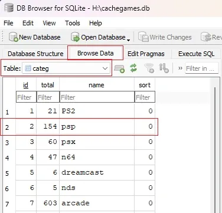

5. Select **game** table.
6. Add new row.
   * **id** PSP = 2
   * **gameid** the highest game id + 1. Tap on **gameid** column to sort it and see the highest number. 
   * **path** - The name of ROM (Need for Speed - Carbon - Own the City (USA).chd or your own).
   * **image** - The path to image (image/NFSCarbon.png or your own).
   * **class_type** - -15, search the correct number at any game with the same platform.
   * **game_type** - 0, search the correct number at any game with the same platform.
   * 4 columns with the game name (any name that suits you - NFS Carbon / Need for speed Carbon, etc.), it is the name you
will see in the game list.
   * **name** - leave empty or add something like - NFSCarbon.
   * **fav** - 0, not favorite / favorite = 0 / 1.
   * **idx** - assigned automatically.
   * **gnum** - use **gameid**.
   * **his** - 0.
   * **sort** - 0.
7. Click save (Ctrl+Shift+S) and close.

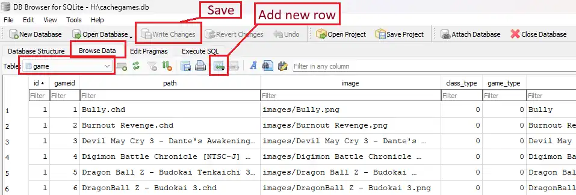

The game is now registered and will appear in PSP game list.

To remove - delete an appropriate row from **game** table, decrease the number of games for a specific platform 
in **categ** table and delete ROM / image files.

To replace - edit an appropriate row, you only need to change **path**, **image** and 4 name cells, then delete / add according ROM / image files.

## Game DB Tool

The tool is designed to automatically detect and register added and removed games, fix database errors, create custom game collections, clean up unnecessary and temporary files from the SD card, and download missed or bad images from the Web.

You can download a compiled [Windows version](https://github.com/SergeyVorobiev/M88-GameStick-Patch/releases/latest/download/M88GDBTool_1.9.exe) or run it from [sources](UIMain.py).

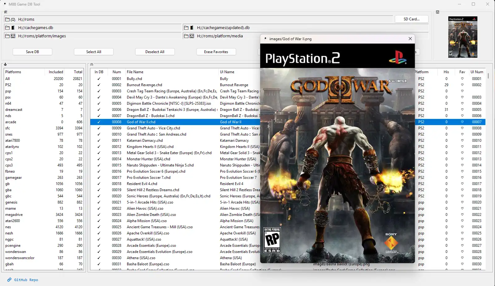

Click **SD Card...** and choose your **SD Card** folder or any other folder which has **roms** and **cachegames.db** inside.
**cachegames.db** is used to define game UI names, image paths, and UI numbers. If it does not exist, the program will use game file names to
assign game UI names and image paths.

**In DB** column shows the status of a game. "✗" means that the game files exist, but the game is not registered, so the main stick app UI will not show it. 
"✓" means that the game is registered and will be shown in the main stick app UI. To change the status, click on the according cell or double-click on the according row.
**Select All** and **Deselect All** buttons will change the status of all games for current platform accordingly.

**Fav** column represents **favorites**. Click "♡" to change the current favorite status of a particular game. You can also erase
all favorites for current platform by clicking on **Erase Favorites** button.

**His** column represents **history**. You can erase history for the whole platform by clicking on **Erase History** button.

Double-click or right-click on **Image Path** cell will open image preview window for a particular game.

Right-click on **File Name** or **UI Name** will allow you to synchronize the game file name <-> UI name <-> image name (i.e. make them the same),
which helps to keep DB consistent and independent of old DBs because the only file names could be used to determine correct UI names and image paths.

**Clean Game Folders** option is used to move all temporary and garbage files from platform folders to the specified folder thereby clearing up SD card space.
Those folder can later be deleted manually if not needed.

**Clean Image Folders** option is used to move all not used or zero sized image files (.png) and other garbage from platform image folders to the specified folder thereby clearing up SD card space.
Those folder can later be deleted manually if not needed.

After performing necessary operations click **Save DB** button, it will create **cachegames(updated).db** file on your SD card.
Rename it to **cachegames.db** to be used by your game stick. Don't forget to back up your previous **cachegames.db file**.

Adding a game example:

1. Download a game you want to add, like - *Sonic Adventure 2 (USA).chd*.
2. Download a box art and name it the same as the game - *Sonic Adventure 2 (USA).png*.
3. Put the game file into the appropriate folder - *sdcard/roms/dreamcast/Sonic Adventure 2 (USA).chd*.
4. Put the artbox file into the appropriate folder - *sdcard/roms/dreamcast/images/Sonic Adventure 2 (USA).png**.
5. Run GameDBTool, select *dreamcast* platform and find your game with "✗" symbol inside of **In DB** column meaning that
the game is not registered yet.
6. Click on the "✗" cell to make it "✓" and then click **Save DB** button.
7. Go to *sdcard* and rename *cachegames(updated).db* to *cachegames.db*. Do not forget to back up the old one.

\* You can try to not add the artbox, in this case the stick will try to do a screenshot when you exit the game to make a custom artbox automatically,
but because of some internal bug in the system the image might not be always flushed properly leaving the 0-size file on sdcard.

Download an image example:

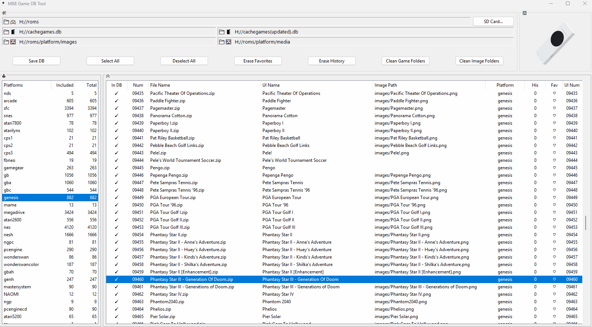

## Easter Eggs

The stick supports at least two additional platforms out of the box: Sega Saturn (Yaba Sanshiro) and MS-DOS (RetroArch).

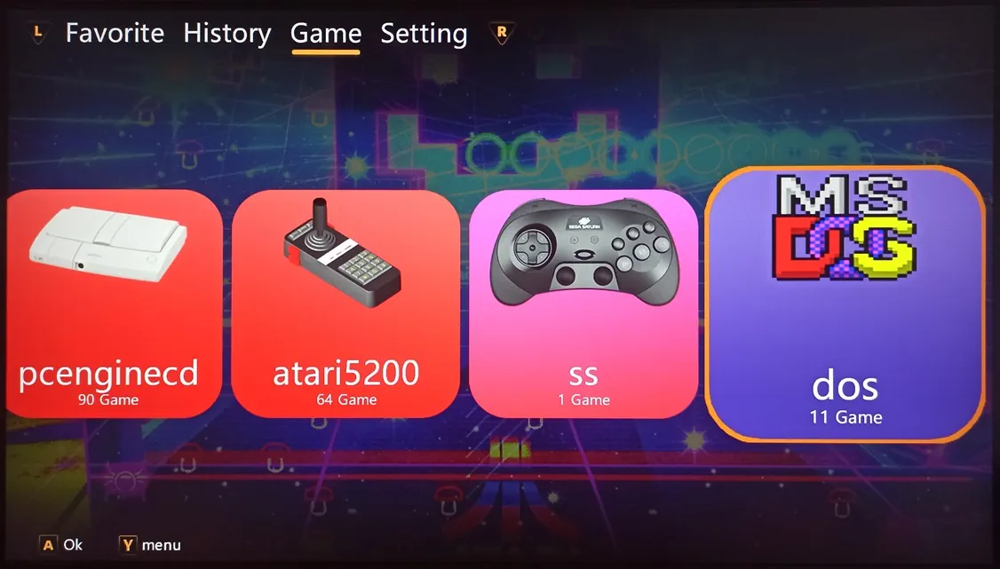

To activate them:

1. Go to *sdcard/iroms* and create folders with the next names: *dos* and *ss*.
2. Go inside *sdcard/iroms/dos*, *sdcard/iroms/ss* and add *bg.png* and *icon.png* (You can take *bg.png* from other platform and *icon.png* [here](resources/images)).
3. Go to *sdcard/roms* and create folders: *dos* and *ss*.
4. Inside the *dos* and *ss* create *images* folders. (*sdcard/roms/dos/images*, *sdcard/roms/ss/images*).
5. Prepare game files and [boxarts](https://thumbnails.libretro.com/), put game files and image files accordingly, for example:
*sdcard/roms/dos/fallout1997.zip* and *sdcard/roms/dos/images/fallout1997.png* etc.
6. Register added games by using [GDBTool](#game-db-tool).
7. Download *dosbox_pure_libretro_android.so* from [here](https://buildbot.libretro.com/nightly/android/latest/armeabi-v7a/) if it does not exist in *sdcard/RetroArch/cores*.
8. Put the downloaded core into *sdcard/RetroArch/cores* folder.
9. Enjoy.

MS-DOS tips:

1. Go to **Quick Menu** -> **Core Options** -> **General** -> **Force Output FPS** and set 30-50 FPS to prevent video / audio lags especially
with shaders enabled.

    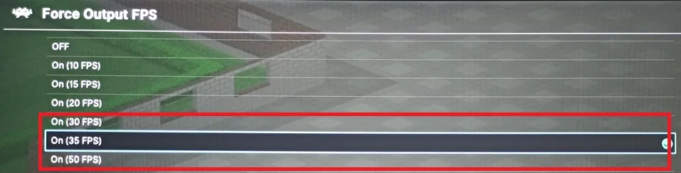

2. Setup input control manually or go to **Quick Menu** -> **Controls** -> **Port 1 Controls** -> **Device Type** and set
an option with a mouse.

    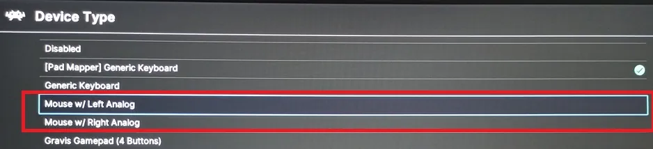

Fallout1997 (MS-DOS) & Langrisser 3 (Sega Saturn)
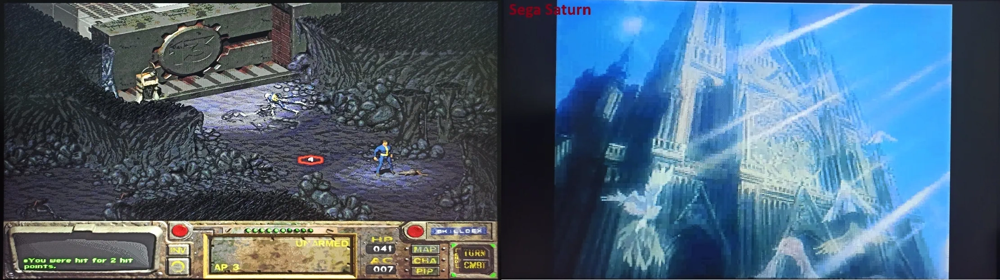

Heroes 2 & Red Alert
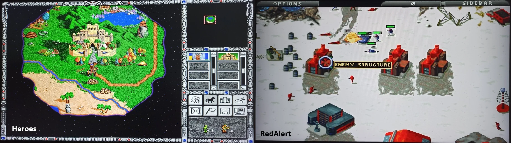

Sim City 2k & Theme Hospital
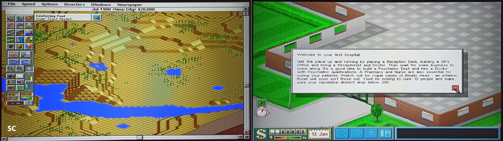

Transport Tycoon Deluxe & War Craft 2
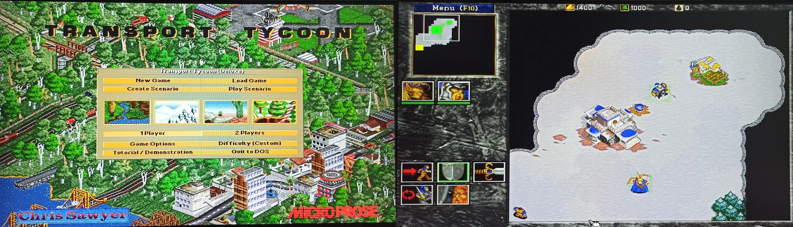

*You can save game progress as usual by using hot keys or quick menu in up to 1000 slots.*

## Other Platforms

Current firmware version does not allow you to add new platforms directly, even though you can create new folder in *iroms* and 
set up a background and an icon for your new platform, you can then add games in *roms* folder accordingly, register them in DB, finally the main app of stick
will see your games inside new category, but it, unfortunately, will not know what to do to run them properly. Instead, you can exploit [core mapping](#core-mapping) 
and run any platforms supported by RetroArch replacing current ones.

What to play:

1. Wii / GameCube - (dolphin_libretro_android.so, only arm-v8), since v2.3 - Dolphin emulator, RA64.
2. Nintendo 3DS (citra_libretro_android.so, azahar_libretro_android.so, panda3ds_libretro_android.so, only arm-v8), since v2.3 - Citra emulator, RA64.
3. N64 (parallel_n64_libretro_android.so, mupen64plus_next_gles3_libretro_android.so).
4. Atari Jaguar (virtualjaguar_libretro_android.so).
5. 3DO (opera_libretro_android.so).
6. Sega CD, 32X (picodrive_libretro_android.so).
7. Commodore 64 (vice_x64_libretro_android.so).
8. MSX (bluemsx_libretro_android.so).
And many more...

3DO example (For internal RetroArch 32x, deprecated since v2.3 due to RA64 full support):

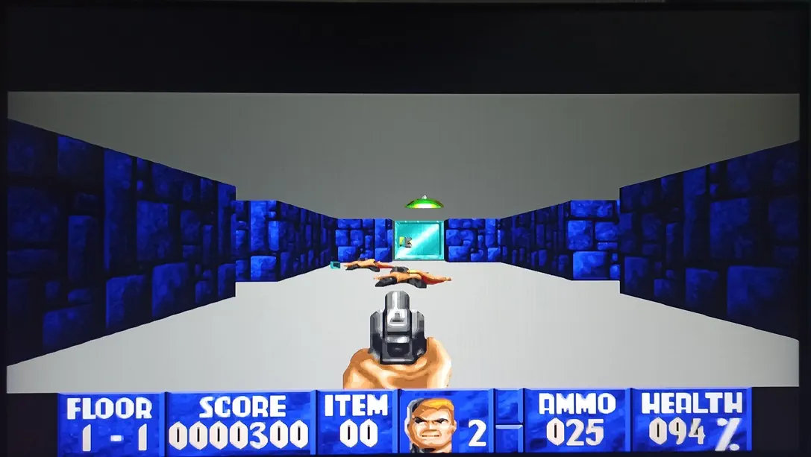

1. Download *opera_libretro_android.so* from [here](https://buildbot.libretro.com/nightly/android/latest/armeabi-v7a/) if it does not exist in *sdcard/RetroArch/cores*.
2. Put the downloaded core into *sdcard/RetroArch/cores* folder.
3. Choose some RetroArch platform you want to be replaced by new platform (e.g. Atari5200).
4. Move all games and images from *sdcard/roms/atari5200* to a safe place.
5. Unregister all atari5200 games by using [GDBTool](#game-db-tool).
6. Take *Wolfenstein 3D.chd*, and a [boxart](https://thumbnails.libretro.com/The%203DO%20Company%20-%203DO/Named_Boxarts/).
7. Put the game file (.chd) and the image file (.png) into *sdcard/roms/atari5200, sdcard/roms/atari5200/images* accordingly.
8. Register added game by using [GDBTool](#game-db-tool).
9. Open *sdcard/RetroArch/coremap.cfg* and change the line to ***atari5200->opera_libretro_android.so****.
10. Enjoy.

\* The stick will try to run your game file as an **atari5200** but the *a5200_libretro_android.so* core will be 
replaced by *opera_libretro_android.so* forcing your game file to be launched under opera core.

## Windows Emulation

Heroes 3 & Windows 98
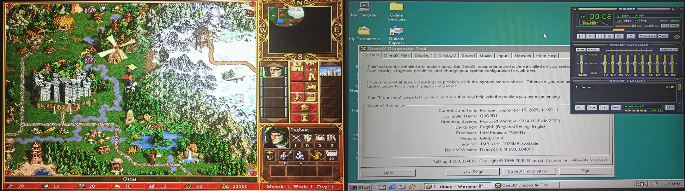

By using *dosbox_pure_libretro_android.so* core you can emulate Windows 95 / 98. But at first, you have to know about necessities and drawbacks:

1. It's strongly recommended to DIY some passive / active cooling. Or at least you can place the stick with the vents facing down on some laptop cooling pad.
2. It's recommended to replace the original sd card by 128-512GB class 10 or even A1 (A1 though may cost even more than the stick itself).*
3. The stick can provide only 25k-75k cps (something between 486DX2 and Pentium 66Mhz, which is not enough for comfortable playing such games like Heroes 3 as for example).**

\* *Usually sdcard of the M88 out of the box is total junk (class 0-1). It will not allow you to create a disk to install Win98 with appropriate size (512MB and above),
because in time of creation the system will think that the process is frozen and just kill it. The workaround will be explained below*.
Format your new sdcard as exFAT, don't use FAT32 or NTFS, exFAT is designed specifically for flash storage and practically has no volume limits.
Then put all the files from the old sdcard to the new one.

\** Even relatively modern 8 cores Ryzen 5 laptop could not provide Pentium 3 level and can barely go beyond Pentium 2 300mhz (200k+ cps),
because the emulation is single threaded, making it only 13% loaded. For that reason the strong side of the P65 (6x+2x cores)
does not play any role.

Diablo & SC3000
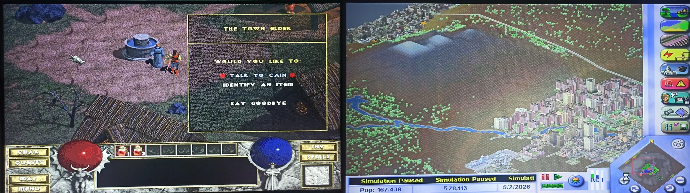

Setup:

1. Read [Easter Eggs](#easter-eggs) and try to set up and play MS-DOS games first to be comfortable with *dosbox_pure_libretro_android.so* and its settings.
2. Download and unpack [Win98SE_HDD](https://github.com/SergeyVorobiev/M88-GameStick-Patch/releases/latest/download/W98HDD.7z).
3. Download [Win98SE.iso](https://dn720503.ca.archive.org/0/items/windows-98-se-isofile/Windows%2098%20Second%20Edition.iso).
4. Place ***Win98SE_HDD.img*** file into *sdcard/RetroArch/system* folder.
5. Create *sdcard/roms/dos/Win98* folder.
6. Put ***Win98SE.iso*** disk file into *sdcard/roms/dos/Win98* folder and any other disk files you are going to use (usually it's .iso and .cue + .bin disk files).
7. Create a file ***Win98 Playlist.m3u*** in *sdcard/roms/dos*, and register all disk files you have in ***Win98*** folder by editing it via notepad, like for example:
    ```
    Win98/Win98SE.iso
    Win98/Heroes3.iso
    Win98/Sid Meier's Civilization III (USA, Europe).cue
    Win98/Tools.iso
    ```
    At the beginning it can be just one line (the more files you add in Win98 folder the bigger the list), you don't need to register (in DB)
    anything, added files will be detected automatically:
    ```
    Win98/Win98SE.iso
    ```
8. Register your *Win98 Playlist.m3u* via [GDBTool](#game-db-tool).
9. Run the stick and launch *Win98 Playlist.m3u* in **dos** catalog.

    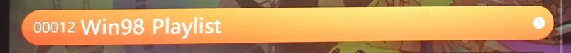

10. You will see the list of disk files, select **Run Installed Operating System** and launch **Win98SE_HDD**.

    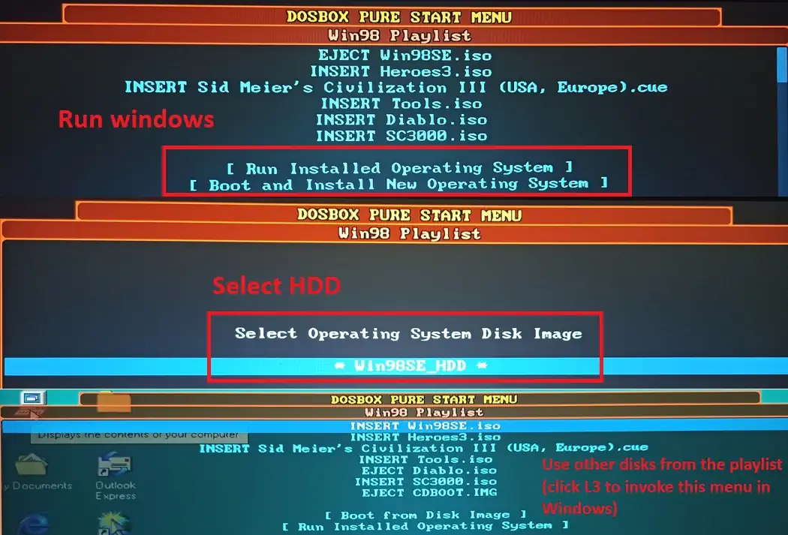

11. Under Windows select L3 to activate dosbox menu and switch between disks.

You can try to install your own windows 95-98, but keep in mind that you need to create at least 512MB disk, with the 
default sdcard the stick likely will not allow you to do it because for anything beyond 64MB it will think that the 
process is frozen and kill it, so you have two options:

1. Use class 10 sdcard and try to create 512MB-2GB disk (win98SE.img) during installation (it must have FAT32 if you want to increase the size further).
   1. Install Windows.
   2. Take your disk and increase its size with the CMD command: `truncate -s '16000M' 'win98SE.img'`, where '16000M' means 16GB, use your own number.
   3. Open this disk in Disk Genius and expand your 512MB partition to 16GB*. 

    \* *Disks beyond 2GB might not be seen by DOSBOX on the stick.*

or:

2. Install Desktop version of RetroArch, and install your Windows 98 under it with any disk size you wish.
   1. Use created image as described above under the **Setup** section.

## Full House

Since v2.3* you have the ability to run new emulators (Citra, Dolphin, RA64). It relies on the injected application providing the
installation and launching methods. You should also read [Controller Problems](#controller-problems) paragraph first.
It also has the TotalCommander on the board, which opens the door for installation and launching of potentially whatever you want. Be aware,
by modifying the system with Total Commander you may brick the device (be ready to reflash it at any moment).

\* *Minimum GDBTool version for the update is v1.9*.

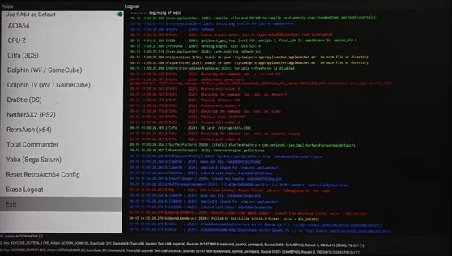

To run the application:
1. Go to *sdcard/roms/n64* folder and create a file *Apps.m3u*. (or any name which ends with Apps.m3u -> 1Apps.m3u).
2. Register it by using [GDBTool](#game-db-tool).
3. In the main UI choose the N64 category and click on *Apps*.

    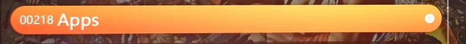

4. After first run it will recalibrate the pixels density according to your screen.
5. The TotalCommander is already installed, other applications will be installed on the first click and then launched on the next*.

\* *The silent installation relies on superuser (xbin/su). If for some reason it does not work out, the system will fall back to the normal installation process.
The problem is that in a normal mode it most likely will not show you appropriate dialogs, click (-> A) for several times with some pauses in between, it should work out.
In case if you are using normal installation, you have to update retroarch config manually, Click **Reset RetroArch64 Config** option*.

### RetroArch64 Tips

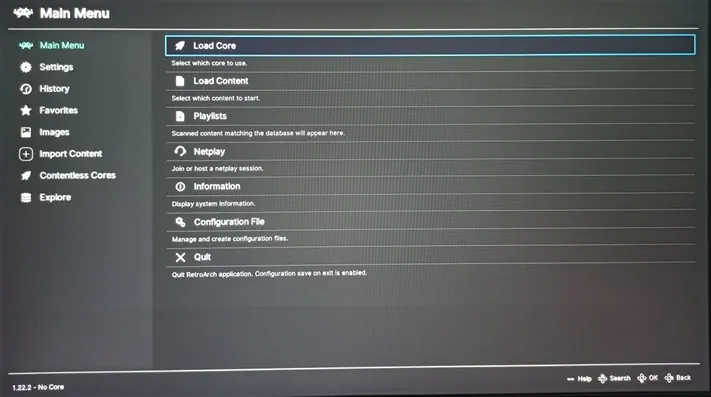

With RetroArch64 you can play any platform it supports (by installing cores manually), moreover
you don't need to register game files anymore, because you can choose whatever game / core from whatever folder on sd card directly from RetroArch main menu.
However, if you want to launch games from the main UI, then you need to register them (by using GDBTool) after adding as usual.

\* *You can make all the games from main UI to be launched under RA64, just create the **sdcard/RetroArch/useRA64** file,
or even more easily, turn the switch on*:

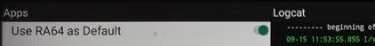

*Keep in mind the 64 cores must be installed in advanced manually.*

To install cores do the next:

1. Update the [RetroArch folder](https://github.com/SergeyVorobiev/M88-GameStick-Patch/releases/latest/download/RetroArch_v2.3.7z). it has needed 64x cores.
2. Open RetroArch main menu.
3. Go to **Settings** -> **Core** -> **Manage Cores** -> **Install or Restore a Core**.
4. Choose the path */storage/A046-6AFE/RetroArch/cores64* and select a core to install*. (Your UUID of SD card will be different).

\* *Install all accessible cores in advance to not catch 'white screen' because you forgot to install an appropriate core*.

*Note: RetroArch64 will not recheck manual config changes on each run, (it applies once after installing the app), therefore, if you have changed or formatted your sd card its UUID will be
changed and paths will be broken. To reapply the valid config click **Reset RetroArch64 Config** option*.

*Note: If for some reason you have wrong configuration without ability to navigate over the main menu, then you have to create your
own config with appropriate options and button keys. See an example: [RetroArchConfig](src/replace/retro64/retroarch.cfg). Create one on your sd card and copy it in **/system/res/retroarch.cfg** then
click **Reset RetroArch64 Config** option or copy it directly in **/storage/emulated/0/Android/data/com.retroarch.aarch64/files/retroarch.cfg** 
with Total Commander. In the second case you must resolve all paths to SD card in the config manually.*

*Note: Your RetroArch64 config does not affect RetroArch32 and vice versa. Please do not change the default config paths
(i.e. don't choose configs from other places), because stick's UI relies on these paths when launching games, do the changes in place*.

### Citra Tips

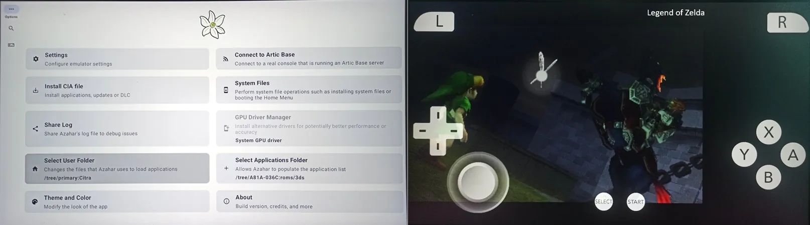

1. On the first screen tap some buttons on D-pad to catch a focus, use 'TAB' (Right shoulder) button to navigate between items.
2. Select **User folder** - you can use 'Citra' folder right on eMMC* or create your own on SD card in advance to choose it.
3. Create a game folder *sdcard/roms/3ds* on your SD card in advance and choose it.
4. If games do not start, change **Graphics API** from **Vulkan** to **OpenGLES** in **Graphics** settings.
5. Carefully map controller buttons in the settings.
6. Enjoy.

\* *To create an empty folder with appropriate name on eMMC, create it on your SD card first, then with **Total Commander**
go to **/storage/self/primary** and copy your folder inside*. Keep in mind that user disk space is very limited, consider
using SD card for everything.

### Dolphin Tips

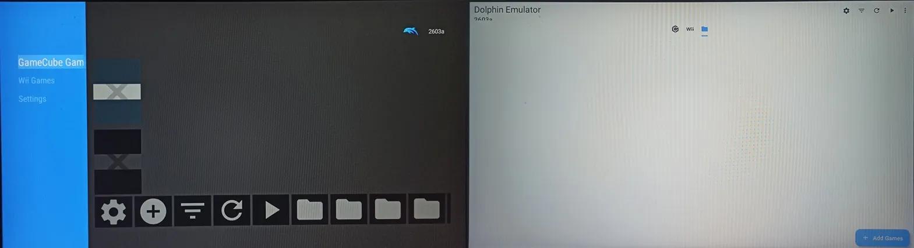

1. You can choose among both variants (Standard / Tv). Tv version is more preferable for navigation.
2. Create folders with games on your SD card like *sdcard/roms/wii*, *sdcard/roms/cube* and put games inside.
3. Open the Dolphin and select '+' button, navigate to your folders and select them one by one.
4. Carefully map controller buttons in the settings.
5. Enjoy.

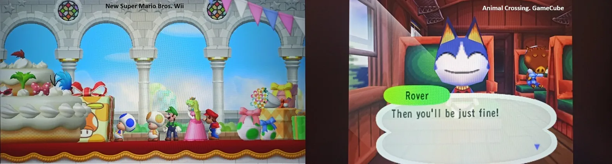

### Controller Problems

Android OS has very crooked support for gamepads, and some old emulators too. Curtains, top bars, burger buttons, are often unreachable with the standard gamepad functionality.
Firmware v2.3 has some fix, allowing you to enlist screen items by using 'Right Shoulder Button', which is enough in
many cases (and also to print 't' letter by using 'Right Trigger Button'*), but the fix only relates to Vendor_0810_Product_0001 (Twin USB Joystick 2064/1) gamepad. You can see
your gamepad model by using AIDA:

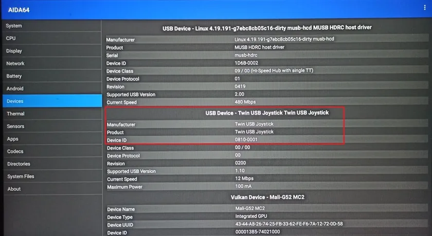

\* *Try to use your external sd card for everything, but if you really need to create some empty / or with files folder 
inside eMMC, then create it on your sd card and copy to appropriate place with Total Commander*.

If you have a different controller model you probably ought to fix it by yourself (in case you found some issues).
To give your controller some additional functionality prepare the files the similar way as in these examples:

1. [kcm file](src/replace/keychars/Vendor_0810_Product_0001.kcm).
2. [kl file](src/replace/keychars/Vendor_0810_Product_0001.kl).

Read official android documentation:
1. [Key layout](https://source.android.com/docs/core/interaction/input/key-layout-files).
2. [Key character map](https://source.android.com/docs/core/interaction/input/key-character-map-files).
3. [Input device configuration](https://source.android.com/docs/core/interaction/input/input-device-configuration-files).

Then put the kcm, kl files (by using TotalCommander from your SD card (usually generic settings should allow you to do it)) accordingly to:
1. *system/usr/keychars*.
2. *system/usr/keylayout*.

*To get more details about controller's setup see this [paragraph](#custom-controller-setup).*

How to choose your sdcard from system 'Files' app:

1. Use D-pad to focus a section.
2. Navigate to a burger button by using 'TAB' (Right Shoulder button according to updated keylayout) and click 'A' button.

    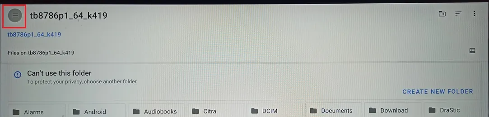

3. In an appeared curtain push 'A' but not release, you will see the current selection.

    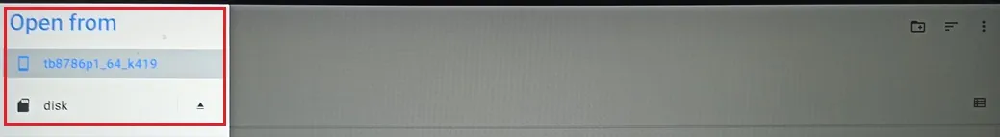

4. Use D-pad to move up or down (you will not see the selection, just count).
5. Release 'A' button to select needed item (disk = your SD card).

>[!NOTE]
>Some screens like system 'Recent' or Yaba require you to switch between sections, where 'TAB' button could not help. Ctrl + 'TAB'
>should do the trick, but unfortunately, even this trick seems not working on stick's Android OS version. 

## Third Party Controller Setup

Usually chip Chinese Twin controllers, supplied with game sticks, have analog triggers with quite bad precision, here is 
the example of how to connect and set up a third party controller.

### GAMESIR NOVA 2 LITE Setup

You can use much more comfortable and precise controllers which support Android OS.
GAMESIR NOVA 2 LITE* is a budget, precise and quite heavy controller supporting vibration and having 3 modes: XBox (Green), 
Nintendo Switch (Red), Dual Shock 4 (Blue). Green variant is only for PC. The more appropriate one would be a controller
supporting **trackpad** which gives you the ability to use cursor right in menus or system applications for easy navigation 
and access to all UI elements. 

\* *Be careful if you want to use GAMESIR products for two players mode on Android. The problem is that their controllers 
might have the same unique id and descriptor which Android considers as a single device. If
a game or an emulator relies on Android API, then both controllers will control the same player.*

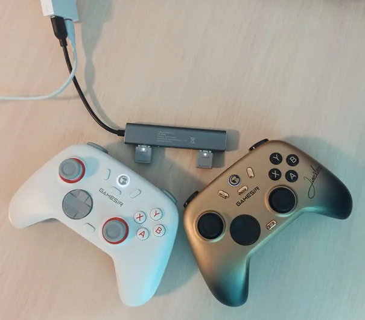

Setup:
1. Two GAMESIR controllers set in DS4 (Blue mode) / NS (Red mode).
2. Two dongles. (Included in the set).
3. One USB-A Hub. (Budget version ~2-3$ is totally enough if you care).
4. Put [ds4 kl](src/replace/keychars/Vendor_054c_Product_09cc.kl) in *system/usr/keylayout* folder. Remove all files with the same
vendor and product but different versions.
5. Put [ns kl](src/replace/keychars/Vendor_057e_Product_2009.kl) in *system/usr/keylayout* folder. Remove all files with the same vendor and product but different versions.
6. Put [ds4 kcm](src/replace/keychars/Vendor_054c_Product_09cc.kcm) in *system/usr/keychars* folder.
7. Put [ns kcm](src/replace/keychars/Vendor_057e_Product_2009.kcm) in *system/usr/keychars* folder.
8. Put [excluded devices](src/replace/keychars/excluded-input-devices.xml) in *system/etc* folder.
9. Make sure you have Nintendo Switch Pro Controller.cfg file and Sony DualShock 4 Controller v2.cfg file in *sdcard/RetroArch/autoconfig/custom* folder.

*Use Total Commander to put kcm / kl / xml files in system folder.*

*In case if controllers work properly after the connection, you don't need to create and copy / replace kl files, but if you
don't have trackpad, you still need to create / copy kcm file to activate 'TAB' button to be able to move across elements in
system applications.*

*If you have problems with separate controllers detection then use one in NS mode and the second in DS4 mode.*

With this setup you can also plug your original dongle, expanding the amount of controllers up to 4. It is also possible to
plug 4 twin pairs, expanding the amount of controllers up to 8.

### Custom Controller Setup

If you have some different controller model, and it works improperly then it's better to make / replace kcm / kl files yourself:

1. Identify your PID / VID using AIDA or Apps:

    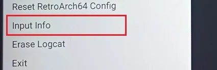

2. Select your controller:

    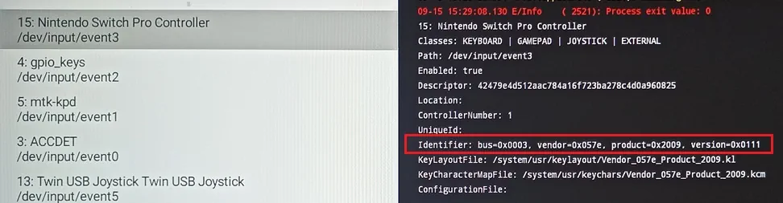

3. Create two empty files with your VID / PID numbers - Vendor_057e_Product_2009.kl, Vendor_057e_Product_2009.kcm. Ignore version.

4. Start to test your controller to fill your kl file:

    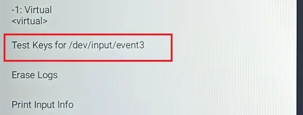

5. Press buttons to see key codes:

    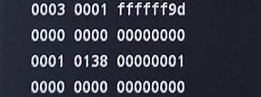

    0001 = key, 0003 = axis

6. See [android codes](https://developer.android.com/reference/android/view/KeyEvent) to assign buttons.

    Example:

    axis 0x01   Y = when axis (0003) 0x01 is pushed - send Y signal.

    key 0x138   BUTTON_L2 = when key (0001) 0x138 is pushed - send BUTTON_L2 signal.

7. Fill kcm file to map the second action:

    Example:
    
    ```
    key BUTTON_L2 {
        base:                               fallback PAGE_DOWN
    }
    ```

    Meaning: if an application did not handle L2 signal - send PAGE_DOWN signal.

8. After preparing appropriate kcm, kl files for your controller, put them in *system/usr/keychars*, *system/usr/keylayout* 
folders accordingly with Total Commander.

### RetroArch Controller Setup

To avoid some unexpected bugs and wrong behavior you need to be aware about next things:

1. Set autodetect option in retroarch.cfg file to true:
`input_autodetect_enable = "true"`.
Because different controllers could use different key codes, and the same controller can have different device id after disabling / enabling,
if this option is false, then you risk to get RetroArch being partially or completely unresponsive.
2. Erase all button keys from your retroarch.cfg file (i.e. all lines like - input_player1_a_btn = "nul" must not have numbers).
Default button numbers might conflict with autodetection, leading to unexpected bugs. Do not touch hotkeys though,
they better be hardcoded in the config file.
3. Use autoconfig only for RetroArch64. As RetroArch32 is partially installed on the stick, autoconfig most likely will
not work for it.
4. Some controllers may have additional inputs like 'Motion sensors' or 'Touchpad' that could be interpreted by RetroArch
incorrectly. To disable them create a [file](src/replace/keychars/excluded-input-devices.xml) and enlist all such devices.
Put the file in *system/etc* folder. Use Apps->Input Info to detect such devices.
5. Make an appropriate keys map file and put it in *sdcard/RetroArch/autoconfig/custom* folder. See existing [examples](src/replace/keychars/retroarch/android).
VID and PID must be decimal not hexademical. See [this](https://developer.android.com/reference/android/view/KeyEvent) to assign
correct Android key codes. Without this file, RetroArch would not know what keycodes to assign after auto-detecting the controller.
6. When you create autconfig file for RetroArch, usually the axis codes for right analog stick (R3) are always ±2 for X and ±3 for Y
even if the real codes are different.
7. Android always produces D-PAD codes for D-PAD - 19,20,21,22 even if a joystick generates axis HAT_X/Y, but RetroArch does not
understand it, for that reason it's practically impossible to just hardcode android keys for 'every' controller right 
in retroarch.cfg file, (to forget about bug-y input autodetection) even though it should be possible in theory.
8. For some reason, some games, being run from stick's UI directly, do not pick up key codes automatically, run such games from RetroArch64
main menu.
9. If for some reason RetroArch64 is unresponsive, you have to edit its configuration file manually. Go to *system/etc/retroarch.cfg*,
copy it to your SD card, fix it manually, and put it back with Total Commander, then click **Reset RetroArch64 Config** option in **Apps**
to generate actual retroarch.cfg with resolved SD card paths.

## Graphic Settings

### PSP

```
Backend                             OpenGL
Rendering resolution                4x PSP
Display resolution                  Native device resolution
Fullscreen                          Off
Frame skipping type                 Percent of FPS
Auto frameskip                      On
Disable culling                     Off
Skip GPU Readbacks                  Skip
Lazy texture caching                On
Spline/Bezier curves quality        Low
Buffer graphics commands            Up to 1
Hardware transform                  On
Software skinning                   Off
Hardware tessellation               Off
Upscale type                        Bicubic
Upscale level                       Off
Deposterize                         Off
Anizotropic filtering               0x - 4x
Texture filtering                   linear / auto
Smart 2D texture filtering          On
Lower resolution for effectes       Aggressive
```

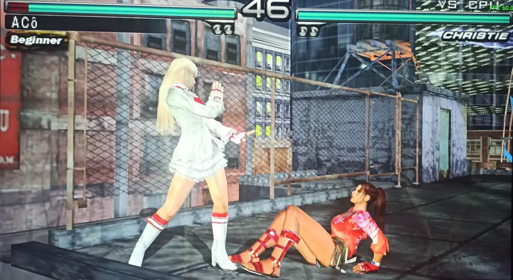

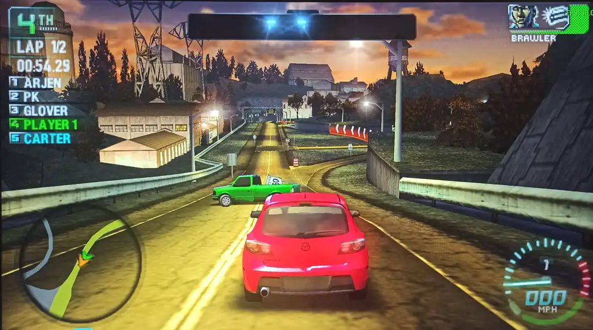

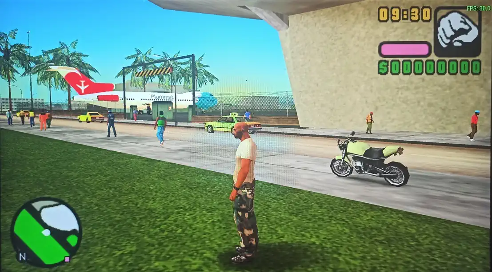

### Naomi & DreamCast

```
Graphics API                         Vulkan
Transparent Sorting                  Per Triangle
Internal Resolution                  1280x960 / 1600x1200
VSync                                Off
Full Framebuffer Emulation           Off
Load Custom Textures                 Off
Automatic Frame Skipping             Maximum
Shadows                              Off
Fog                                  Off
Delay Frame Swapping                 Off
Fix Upscale Bleeding Edge            On / Off
Native Depth Interpolation           Off
Copy Rendered Textures to VRAM       Off
Anisotropic Filtering                0x - 4x
Texture Filtering                    Force Linear / (Default - if artefacts)
Texture Upscaling                    1x in (3d) / up to 4x in 2d (fightings)
Texture Max Size                     256
Max Threads                          4
```

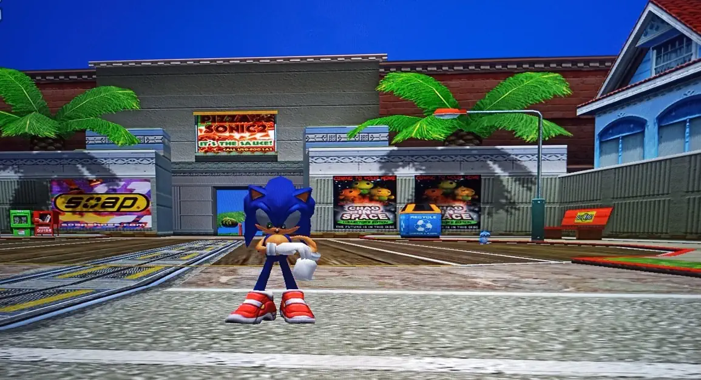

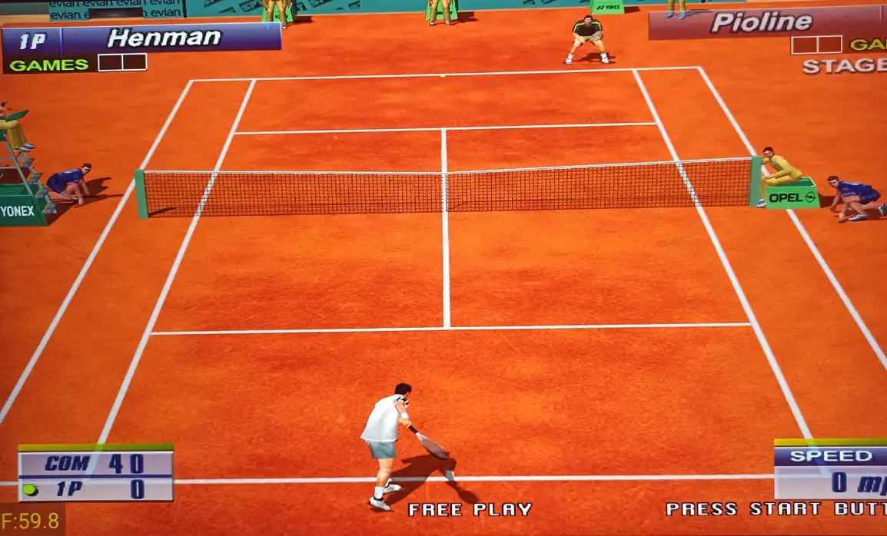

### RetroArch

Core settings for RetroArch platforms: `sdcard/RetroArch/config`.

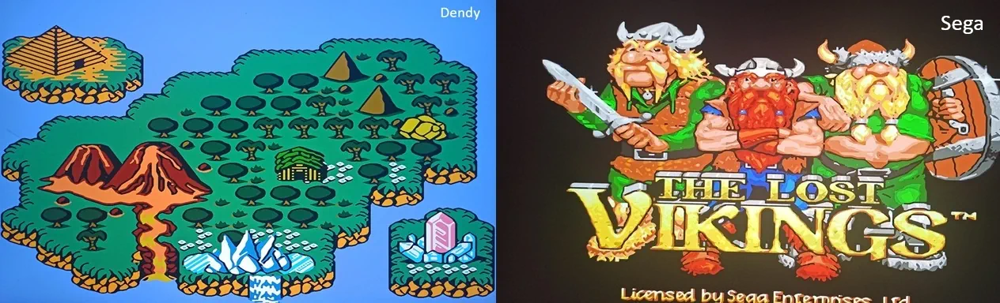

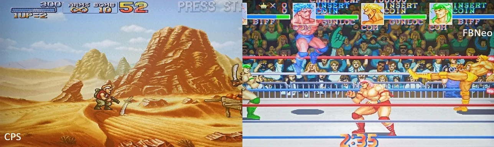

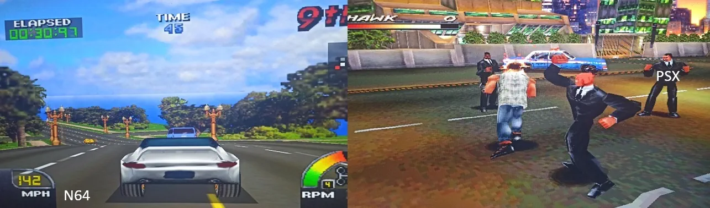

## Scripts

To upgrade your own USER.img (It is recommended to just use GDBTool, you don't need to mess with the steps below):
1. Download this repo.
2. Install [Python](https://www.python.org/downloads/) and add PATH:
    * `path_to\Python\Python3xx`
    * `path_to\Python\Python3xx\Scripts`
   
    Check installation, open CMD and type:
    
    `pip -V`

    `py --version`
    
3. Install IDE [PyCharm](https://www.jetbrains.com/pycharm/download/) or use your preferable one.
4. Install [JDK](https://adoptium.net/) to allow the scripts to work with *.apk files.
    
    Check installation, open CMD and type:
    
    `java --version`

5. Install [Cygwin](https://www.cygwin.com/). (It will allow the scripts to invoke many linux-like programs, avoiding using WSL, VMWare etc.).

    Add PATH to use cygwin programs from anywhere:
    * `path_to\cygwin64\bin`
    * `path_to\cygwin64\sbin`
    * `path_to\cygwin64\usr\sbin`
   
    Check installation, open CMD and type:
    
    `debugfs -V`
 
    `truncate --version`

    `resize2fs`
    
    Look for them [here](https://cygwin.com/packages/) if they are missed.
6. Open the repo in your IDE and go in [here](src/img/original). Put your original USER.img (backup), add an extension - *.img if needed.
7. Open [Main](src/Main.py) and click *run button* (green triangle near *if __name__ == '__main__':*).
8. Upgraded USER.img should appear [here](src/img/result), use it to flash your stick instead of provided one.
9. Go back to [fix options](#how-to-fix) and perform steps from option one.

For manual image unpacking you can use [7-zip](https://www.7-zip.org/download.html).

To compile / decompile apks use [apktool](https://apktool.org/). Be sure you have [JDK](https://adoptium.net/).

To pack / unpack boot (kernel, ramdisk, dtb) use [magiskboot](https://github.com/alitekin2fx/magiskboot).

Example:

Download repo and place an image of your stick (USER.img) or some android image and put it [here](src/img/original).
Depending on the android version it can contain vbmeta.img, super.img, ... inside or just system.img (old versions).
super.img usually contains system.img, vendor.img, system_ext.img, product.img.

To unpack USER.img:

```
MainSystemTool.unpack_partitions("img/original/USER.img", "img/original/extracted")
```

To unpack Super.img:

```
SuperTool.lpunpack_image("img/original/extracted/45.super.img", "img/original/extracted/super")
```

To check footer:

```
AVBInfo.print_info_image("img/original/extracted/super/system_a.img")
```
You can try some predefined commands to update a footer [here](src/CMDAVBToolExecutor.py), it is better to disable checks
to not mess with this if it is possible.

To unpack ext4 image:

```
Ext4UnpackTool.unpack("img/original/extracted/super/system_a.img", "img/original/extracted/super/system")
```

To decompile some apk:

```
apk_tool = APKTool()
apk_tool.decompile_into('img/updated/d_apk/emu', 'img/original/extracted/super/system/system/app/emu/emu.apk')
```

To search strings:

```
OtherTool.find_strings('img/updated/d_apk/emu/lib/armeabi-v7a/libEngine.so', grep="am start")
```

Compile apk file and sign automatically by predefined key for debugging or game sticks.

```
apk_tool.compile_and_sign('img/updated/d_apk/emu', 'img/updated/apk/emu.apk')
```

Removing / adding files from ext4 images:

```
modify_tool = Ext4ModifyTool("img/updated/system_a.img")
modify_tool.remove_file("system/app/emu/emu.apk")
modify_tool.remove_file("system/app/emu/oat/arm/emu.odex")
modify_tool.remove_file("system/app/emu/oat/arm/emu.vdex")
modify_tool.add_file('img/updated/apk/emu.apk', 'system/app/emu/emu.apk')
```

It is possible to create the hierarchy of files and folders in [res](src/res) folder as root and mirror it in the image:

```
# Mirror everything to system_a.img with exact
# hierarchy from default res or specified folder.
modify_tool.mirror_files()
```

Images with untouched size is preferable to just inject:

```
offset = SuperTool.get_partition_offset("img/original/extracted/45.super.img", "system_a")
OtherTool.inject("img/updated/system_a.img", "img/updated/45.super.img", offset)
```

To unpack kernel and ramdisk:

```
magiskboot = MagiskbootTool()
magiskboot.unpack_boot("img/original/extracted/23.boot_a.img", "img/updated/boot")
magiskboot.unpack_ramdisk("img/updated/boot/ramdisk.cpio", "img/updated/boot")
```

To pack ramdisk:

```
magiskboot.pack_ramdisk("img/updated/boot/cpio", "img/updated/boot/ramdisk", "img/updated/boot/ramdisk.cpio")
```

To pack ramdisk, kernel, dtb to boot:

```
magiskboot.pack_boot("img/original/extracted/23.boot_a.img", "img/updated/boot", "img/updated/23.boot_a.img")
```

To inject super back to main image:

```
offset = MainSystemTool.find_offset("img/updated/USER.img", "45.super.img")
OtherTool.inject("img/updated/45.super.img", "img/updated/USER.img", offset)
```
To resize an image:

```
modify_tool = Ext4ModifyTool("img/updated/system_a.img")
modify_tool.resize_img('+500M')
```

After resizing an image you can't just inject it in super image you have to use lpmake, see
implementation of this method as an example:

```
SuperTool.pack_super_m88(product_a_path="img/original/extracted/super/product_a.img",
                         product_b_path="img/original/extracted/super/product_b.img",
                         system_a_path="img/updated/system_a.img",
                         system_b_path="img/original/extracted/super/system_b.img",
                         vendor_a_path="img/original/extracted/super/vendor_a.img",
                         vendor_b_path="img/original/extracted/super/vendor_b.img",
                         original_super_path="img/original/extracted/45.super.img",
                         result_super_path="img/updated/new_super.img")

```

[This class](src/RetroADB.py) is for running RetroArch or extracting its user/data ([abe](https://github.com/nelenkov/android-backup-extractor)) from a device supported adb. 

*Some code sketches and architectural explanations were provided by [](https://grok.com/)*

## Contact

#### Questions about M88 settings / firmware upgrade? Feel free to ask.
 
📬 **Email**: *fxeipi@gmail.com*